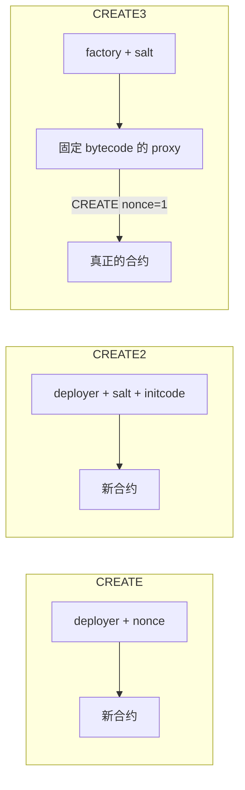

# CREATE / CREATE2 / CREATE3

EVM 只有两个部署操作码：`CREATE`（`0xF0`）和 `CREATE2`（`0xF5`）。**CREATE3 不是操作码**，是「先 CREATE2 一个固定 bytecode 的 proxy，再让 proxy 用 CREATE 部署真正合约」的模式，用来把 initcode 从地址公式里拿掉。

本仓库对应代码：

| 方式 | 本仓库入口 |
| --- | --- |
| CREATE | Foundry `new Counter(0)`：[`bootcamp_2026_s3_vibe_coding_foundry/script/Counter.s.sol`](../bootcamp_2026_s3_vibe_coding_foundry/script/Counter.s.sol)；地址预测：[`bootcamp_2026_s3_vibe_coding_backend/src/wallet/predictCreateAddress.ts`](../bootcamp_2026_s3_vibe_coding_backend/src/wallet/predictCreateAddress.ts) |
| CREATE2 | 跨链同址的 Permit2：`0x000000000022D473030F116dDEE9F6B43aC78BA3`（见 [`TokenBankPermit2.s.sol`](../bootcamp_2026_s3_vibe_coding_foundry/script/TokenBankPermit2.s.sol)） |
| CREATE3 | Solmate 封装 + Counter 部署：[`Create3Factory.sol`](../bootcamp_2026_s3_vibe_coding_foundry/src/Create3Factory.sol)、[`CounterCreate3.s.sol`](../bootcamp_2026_s3_vibe_coding_foundry/script/CounterCreate3.s.sol) |

官方参考：[evm.codes CREATE](https://www.evm.codes/?fork=osaka#f0)、[evm.codes CREATE2](https://www.evm.codes/?fork=osaka#f5)、[EIP-1014](https://eips.ethereum.org/EIPS/eip-1014)、[Solmate CREATE3](https://github.com/transmissions11/solmate/blob/main/src/utils/CREATE3.sol)。

---

## 一张表看完

| | CREATE `0xF0` | CREATE2 `0xF5` | CREATE3（模式） |
| --- | --- | --- | --- |
| 地址取决于 | deployer + nonce | deployer + salt + **initcode hash** | factory + salt（**不含**目标合约 bytecode） |
| 能提前算地址？ | 要先知道即将使用的 nonce | 要先知道完整 initcode（含构造参数） | 只要知道 factory 地址和 salt |
| 构造参数一变 | 地址不变（仍是下一个 nonce） | **地址变** | 地址不变（但同一 salt 只能用一次） |
| 跨链同址 | 几乎做不到（各链 nonce 对不齐） | 可以（同一 deployer、salt、initcode） | 可以，但 **factory 必须先在各链同址** |
| 谁来发 opcode | EOA 或合约都可以 | EOA 或合约都可以 | 必须由**合约**调库；EOA 要先有 factory |
| 典型用途 | 日常 `new Contract()` | 工厂、最小代理、跨链同址协议 | 跨链同址但 bytecode / 构造参数可能不同 |



选法：普通部署用 CREATE；要在部署前锁定地址且 bytecode 已定，用 CREATE2；要跨链同址、且各链 bytecode 或构造参数可能不同，用 CREATE3（先把 factory 放到同一地址）。

---

## CREATE（`0xF0`）

公式：

```text
address = keccak256(RLP([sender, nonce]))[12:]
```

- `sender` 是执行 CREATE 的账户（EOA 或合约），不是交易的 `from` 在内部调用场景下的「原始签名人」。
- `nonce`：EOA 用 `eth_getTransactionCount`；合约用自己的 nonce（每成功 CREATE 一次 +1）。合约 nonce 从 **1** 起算（部署该合约的那次 CREATE 用掉了 nonce 0）。
- **nonce = 0 的 RLP 是空字节串 `0x80`，不是 `0x00`。** 算错会得到完全不同的地址。

Solidity 里 `new Counter(0)` 就是 CREATE。Foundry 广播时，部署者是 `--private-key` 对应的 EOA，地址随该 EOA 的 nonce 走。

预测本仓库下一次 CREATE 地址：

```bash
cd bootcamp_2026_s3_vibe_coding_backend
npm run predictCreate -- 0xYourDeployerAddress
npm run predictCreate -- 0xYourDeployerAddress --nonce 7
npm run predictCreate -- 0xYourDeployerAddress --count 5
```

部署：

```bash
cd bootcamp_2026_s3_vibe_coding_foundry
source .env
forge script script/Counter.s.sol:CounterScript --rpc-url sepolia --broadcast --private-key $SEPOLIA_PRIVATE_KEY
```

---

## CREATE2（`0xF5`）

公式（[EIP-1014](https://eips.ethereum.org/EIPS/eip-1014)）：

```text
address = keccak256(0xff ++ sender ++ salt ++ keccak256(init_code))[12:]
```

- `0xff` 避免和 CREATE 的 RLP 编码碰撞。
- `salt` 是 32 字节，调用方自选。
- `init_code` = `creationCode || abi.encode(constructorArgs)`。构造参数、编译器版本、optimizer 任一变化，hash 就变，地址就变。
- 同一 `(sender, salt, init_code)` 只能成功一次；地址上已有代码时 CREATE2 失败、返回 `address(0)`。

Foundry / Solidity：

```solidity
Counter c = new Counter{salt: keccak256("v1")}(0);
```

EOA 自己没有「固定的 CREATE2 sender」。要跨链同址，通常借助已经在各链同址的部署器，例如 Arachnid 的 Deterministic Deployment Proxy：[`0x4e59b44847b379578588920cA78FbF26c0B4956C`](https://github.com/Arachnid/deterministic-deployment-proxy)（Foundry `StdConstants.CREATE2_FACTORY`）。Permit2 就是这条路上的结果：主网 / Sepolia / 多数 L2 都是 `0x000000000022D473030F116dDEE9F6B43aC78BA3`。

和 CREATE 的关键差别：CREATE2 **把 bytecode 写进地址**。同一 salt、不同构造参数 → 不同地址。这正是 CREATE3 要消掉的那一项。

---

## CREATE3（模式，不是 opcode）

Solmate 实现：[`CREATE3.sol`](https://github.com/transmissions11/solmate/blob/main/src/utils/CREATE3.sol)。库函数是 `internal`，必须由合约调用，所以本仓库用 [`Create3Factory`](../bootcamp_2026_s3_vibe_coding_foundry/src/Create3Factory.sol) 包一层。

两步：

1. **CREATE2** 部署一段**写死的** proxy bytecode（Solmate 的 `PROXY_BYTECODE`）。proxy 地址只取决于 factory + salt + 这段固定 hash，与 Counter 无关。
2. 向 proxy `call(creationCode)`。proxy 用 **CREATE**（自己的 nonce = 1）把 calldata 当成 initcode 部署出去。

最终地址：

```text
proxy     = CREATE2(factory, salt, PROXY_BYTECODE)
deployed  = keccak256(RLP([proxy, nonce=1]))[12:]
          = keccak256(0xd6 ++ 0x94 ++ proxy ++ 0x01)[12:]
```

`0xd694...01` 是「20 字节地址 + nonce 1」的 RLP。目标合约的 creationCode 不出现在公式里。

约束：

- 同一 factory 上同一 salt 只能部署一次（第 1 步 CREATE2 会撞车，Solmate 抛 `DEPLOYMENT_FAILED`）。
- 跨链同址的前提是 **factory 本身先同址**。脚本每次 `new Create3Factory()`（CREATE），factory 地址随部署者 nonce 变，Counter 的 CREATE3 地址也就变了。要跨链复用，应先用 CREATE2 把 factory 钉死，再对 factory 调 `deploy(salt, creationCode)`。
- 部署失败时（构造函数 revert、runtime code 为空）Solmate 抛 `INITIALIZATION_FAILED`。

本仓库部署 Counter：

```bash
cd bootcamp_2026_s3_vibe_coding_foundry
source .env
forge script script/CounterCreate3.s.sol:CounterCreate3Script --rpc-url sepolia --broadcast --private-key $SEPOLIA_PRIVATE_KEY
cat deployments/LATEST.txt
```

salt 为 `keccak256("lbc-2026s3:Counter")`，构造参数 `0`。脚本会先预测再部署，两者必须一致。测试见 [`test/Create3Factory.t.sol`](../bootcamp_2026_s3_vibe_coding_foundry/test/Create3Factory.t.sol)。

OpenZeppelin 也有同思路的 [`Create3.sol`](https://github.com/OpenZeppelin/openzeppelin-contracts/blob/master/contracts/utils/Create3.sol)（proxy 字节码不同，算出来的地址和 Solmate **不兼容**）。本仓库走 Solmate。

---

## 易混点

1. **CREATE3 没有 `0xF6`。** 链上看到的仍是一次 CREATE2 + 一次 CREATE。
2. **「确定性」不等于「与部署者无关」。** CREATE2 / CREATE3 的 sender 仍是执行 opcode 的那个合约。换一个 factory，地址全变。
3. **盐值不是密钥。** 公开 salt + 公开 factory 就能算出地址；冲突保护靠「这个槽已经被占了」，不靠保密。
4. **initcode ≠ runtime code。** CREATE2 hash 的是带构造函数的 creation bytecode。`cast code` 看到的是 runtime，不能拿去当 CREATE2 的 `init_code`。
5. **合约 CREATE 的 nonce 从 1 开始。** CREATE3 的 proxy 第一次（也是唯一一次）CREATE 用 nonce 1，所以上面公式里是 `0x01`。
