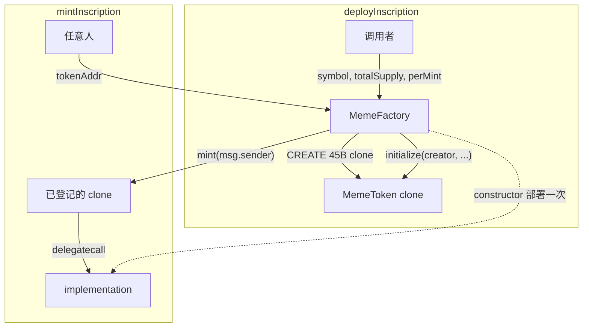

# MemeToken / MemeFactory

一次完整部署一份 ERC-20 大约要把整份 bytecode 写上链；发行 100 个 Meme 就会把同一套 `transfer` / `approve` / `_mint` 重复付 100 次 gas。本仓库用 **EIP-1167 最小代理（clone）**：工厂只部署 **一份** [`MemeToken`](../src/MemeToken.sol) 实现，之后每次 `deployInscription` 只 CREATE 一段 **45 字节** 的代理。所有调用 `delegatecall` 回实现合约。每个 clone 有自己的 storage（symbol、上限、余额），共享同一份代码。

合约：[`src/MemeToken.sol`](../src/MemeToken.sol)、[`src/MemeFactory.sol`](../src/MemeFactory.sol)。工厂对外只有两个方法：

```solidity
function deployInscription(string symbol, uint256 totalSupply, uint256 perMint) external returns (address token);
function mintInscription(address tokenAddr) external;
```

官方参考：[EIP-1167](https://eips.ethereum.org/EIPS/eip-1167)、[OpenZeppelin Clones](https://github.com/OpenZeppelin/openzeppelin-contracts/blob/master/contracts/proxy/Clones.sol)、[ERC-20](https://eips.ethereum.org/EIPS/eip-20)。和本仓库 [`CREATE / CREATE2 / CREATE3`](./create-create2-create3.md) 的关系：`Clones.clone` 走的是 **CREATE**，不是 CREATE2；地址随工厂 nonce 走，不能跨链预先钉死。这是有意的——见下文「为什么不用 CREATE2」。

---

## 一张表看完

| | 实现合约 `MemeToken` | 最小代理 clone | 工厂 `MemeFactory` |
| --- | --- | --- | --- |
| 谁部署 | 工厂 constructor 里 `new MemeToken(address(this))` | `Clones.clone(implementation)` | `new MemeFactory()`（CREATE） |
| runtime 大小 | 完整 ERC-20 + mint 逻辑 | **45 字节** EIP-1167 | 工厂逻辑 + 一份 implementation 地址 |
| constructor | 会跑：写入 `factory` immutable，锁住 `initialize` | **不跑** | 会跑：部署并记下 implementation |
| 个性化数据 | 无（不要拿它当 token 用） | `creator` / `symbol` / `maxSupply` / `perMint` / 余额 | `isInscription` 登记表 |
| 铸造入口 | `mint(to)`，仅 factory | 同左（delegatecall 到实现） | `mintInscription(tokenAddr)`，铸给 `msg.sender` |



| 场景 | 结果 |
| --- | --- |
| `totalSupply=1000e18`, `perMint=100e18`，mint 10 次 | 正好铸满，第 11 次 `CapExceeded` |
| `totalSupply=250e18`, `perMint=100e18` | 只能 mint 2 次（200e18）；剩余 50e18 **不够一次**，revert，不部分铸造 |
| 直接 `token.mint(me)` | `NotFactory` |
| `mintInscription(随机地址)` 或 implementation 本身 | `UnknownInscription` |
| 空 symbol / `perMint==0` / `perMint>totalSupply` | `EmptySymbol` 或 `InvalidSupply` |

---

## 为什么这样设计

作业要的是「能反复发行的 Meme ERC-20」，不是「一个独一无二的治理 token」。约束很具体：省部署 gas、每个铭文参数不同、铸造有上限且按次定量、符合 ERC-20。下面每条选择都对着这些约束，而不是对着「更完整的 token 平台」。

### 1. 为什么用最小代理，而不是每次 `new MemeToken()`

`new` 是 CREATE，每次把整份 ERC-20 runtime（数 KB）写进新地址。Meme 发行的特点是：**逻辑相同、状态不同**。EIP-1167 把「逻辑」钉在一份 implementation 上，新 token 只付 45 字节 + 一次 `initialize` 的 gas。

不选 UUPS / Transparent：那些是**可升级**代理，implementation 可以事后换掉。Meme 一旦发出去，持有人要的是「规则不会被发行者改掉」。最小代理把 implementation 地址写死在 clone bytecode 里，物理上不能升级。省 gas 和不可升级，在这里是同一件事。

不在工厂里用一份合约 + `mapping(id => TokenData)` 模拟多 token：那样不是 ERC-20。钱包、浏览器、DEX 认的是「一个地址一个 token」，`balanceOf(user)` 没有 tokenId 参数。每个铭文必须是独立合约地址。

### 2. 为什么 clone 用 CREATE，不用 CREATE2 / CREATE3

`Clones.clone` 走 CREATE，地址 = `f(factory, nonce)`。同一人连发两个 DOGE，地址也不同。

CREATE2（`cloneDeterministic`）适合「部署前就要锁地址」：跨链同址、预计算 pair、让前端在 tx 确认前就能展示 token 地址。本作业没有这些需求。加上 salt 还要决定 salt 规则（谁选、会不会撞、要不要把 symbol 编进 salt），多出来的表面积对当前接口没有收益。

CREATE3 解决的是「同一 salt、不同 initcode 仍同址」。clone 的 bytecode 本来就固定（都是 45 字节 + 同一个 implementation），不存在 initcode 变化导致地址漂移的问题，CREATE3 在这里没有目标。

和 [`create-create2-create3.md`](./create-create2-create3.md) 对齐：**日常工厂用 CREATE；要预先锁地址再用 CREATE2。**

### 3. 为什么拆成 MemeToken + MemeFactory，而不是一个合约

工厂负责「发行多少个、哪些地址是正经铭文」。token 负责「这一个 ERC-20 的余额和上限」。

若把 `mintInscription` 的计数全放在工厂：`mint` 时工厂改自己的 mapping，再调 token 的 `_mint`。两处状态要保持同步，token 的 `totalSupply()` 和工厂记下的已铸量可能分叉。上限放在 **token 自己的 storage**，`totalSupply()` 和 `maxSupply` 在同一个执行上下文里比较，少一个一致性问题。

工厂仍保留 `isInscription`：否则任意地址都能被拿来 `mintInscription`。有人拿一个普通 ERC-20、甚至本工厂的 implementation 塞进来，工厂必须能拒绝。登记表是工厂对「我发过的 clone」的承认，不是 token 的业务数据。

### 4. 为什么 `initialize`，而不是 constructor 参数

clone **不执行 constructor**。constructor 只在 `new MemeToken(factory)` 时对**实现合约**跑一次。若把 symbol / 上限写在 constructor 里，所有 clone 读到的都是空值（它们自己的 storage 是零）。

所以分工是：

| 时机 | 写什么 | 写在哪 |
| --- | --- | --- |
| 实现合约 constructor | `factory`（immutable）、锁 `_initialized` | 实现合约的 bytecode / 它自己的 storage |
| clone 的 `initialize` | `creator`、symbol、`maxSupply`、`perMint` | **该 clone** 的 storage |

`initialize` 必须 `onlyFactory`，并且和 `clone` 放在同一笔交易里。若 `initialize` 是 public、且工厂先 CREATE 再另起一笔去初始化，中间那一档可以被别人抢先 `initialize` 成自己的 symbol。同一事务里做完，抢跑窗口不存在。

实现合约自己在 constructor 里 `_initialized = true`：否则有人会对着 implementation 调 `initialize`，把逻辑合约的 storage 写脏。delegatecall 不会读实现合约的 storage，但实现合约若被当成 token 用、或以后有人误 `mintInscription(implementation)`，锁死更干净。工厂侧再用 `isInscription` 把 implementation 挡在 mint 门外。

### 5. 为什么 `factory` 是 immutable，不是 storage

`immutable` 编进 **bytecode**。clone 的 bytecode 里已经嵌了 implementation 地址；delegatecall 执行的是实现合约的代码，读 immutable 时读的是**实现合约 bytecode 里的值**，所有 clone 看到同一个 factory。

若 `factory` 是 storage：constructor 写的是实现合约 slot 0 附近的值。clone 的同一 slot 是 `address(0)`。结果是 `onlyFactory` 在 clone 上永远对不上，mint 全废；或者更糟——slot 和 ERC-20 的 `_balances` 撞车。

这是 clone 模式的硬规则：**所有 clone 共享的、部署时就知道的常量 → immutable / bytecode；每个 clone 不同的值 → storage + initialize。**

### 6. 为什么 override `name()` / `symbol()`，不沿用 OZ constructor

OpenZeppelin `ERC20` 的 `_name` / `_symbol` 是 **private**，只在 constructor 里赋值。clone 上这两个槽是空的，又改不了父合约的 private 变量。

覆盖 `name()` / `symbol()` 去读 `_memeSymbol`，是在不 fork 一份 ERC-20 的前提下，给 clone 接上元数据。作业只给 `symbol` 一个字符串，`name` 与 `symbol` 返回同一个值：少一个没有来源的参数，避免工厂接口和作业描述不一致。

`decimals()` 不 override，保持 18。这是 ERC-20 的惯例，也避免「有的铭文 18、有的 0」让钱包把数量显示错位。代价是调用方必须传最小单位（`1000e18` 不是 `1000`），见文末易混点。

不手写一套 ERC-20：`transfer` / `allowance` 的边角（零地址、无限授权、`transferFrom` 是否发 Approval）OZ 已经测过。作业要的是发行与铸造，不是再实现一遍 token 标准。

### 7. 为什么 mint 必须经过工厂，token 上不开放

`MemeToken.mint` 是 `onlyFactory`。若 clone 上任何人都能 `mint(to)`，工厂的 `mintInscription` 只是装饰，上限约束可以被绕开（除非 token 自己也查 cap——那工厂就没有存在必要了）。

实际选择是 **cap 在 token、入口在工厂**：

- token 保证「即使用工厂的漏洞去调 `mint`，单次也只能是 `perMint`、且不超过 `maxSupply`」
- 工厂保证「只有我登记过的地址能走这条入口」，并把 token 铸给 `msg.sender`

两层不是重复。缺工厂登记，implementation 或伪造 clone 可能被误调；缺 token 侧 cap，工厂一旦漏检就会超发。测试同时打了 `NotFactory` 和 `UnknownInscription`。

不把 mint 做成 token 的 `public mint()` 再让工厂当唯一调用者之外的「文档约定」：链上没有约定，只有 `require`。

### 8. 为什么按 `perMint` 整份铸造，剩余不足就 revert

`totalSupply=250`, `perMint=100` → 流通 200，剩下 50 永远铸不出来。

另一种写法是最后一次铸 `min(perMint, remaining)`。那样「每次 mint 数量固定」不再成立：合约、前端、索引都要处理「这次可能比较少」。作业参数名叫 `perMint`，语义是步长，不是「尽量填满」。

把上限设成 `perMint` 的整数倍就不会浪费。这是发行者在 `deployInscription` 时就能算清的事，不必在 mint 路径上分叉。

触顶判断用 `maxSupply - supply < amount`，不用 `supply + amount > maxSupply`：后者在 `maxSupply == type(uint256).max` 时加法 overflow，会变成和「超发」无关的 revert。减法在工厂已保证 `perMint <= totalSupply` 的前提下不会 underflow。

### 9. 为什么谁都能 `mintInscription`，不收 ETH

当前接口没有 `price`、没有 `onlyCreator`。对应的产品模型是：发行者定规则（ticker、总量、每份多少），**任何人付 gas 就能领一份**，直到领完。这和「铭文 / inscription」公开 mint 一致，也和作业给的两个函数签名一致——没有收费参数就不要在实现里偷加 `msg.value`，否则作业调用会对不上。

这不是疏忽：

- 发行者若想自己持仓，同样调 `mintInscription`
- 没有平台费、没有分成，工厂没有 `withdraw`
- 没有白名单，无法阻止机器人把 cap 打满

若以后要加价格，应收在**工厂**（一次 `msg.value` 分给 creator / 平台），不要让 45 字节 clone 去处理 ETH。那是下一份作业的形状，不是现在这份接口。

### 10. 为什么 cap 不可改、没有 pause、没有 owner 改参数

`maxSupply` / `perMint` / `symbol` 只在 `initialize` 写一次。creator 没有 `setPerMint`。

Meme 的可信点往往是「上限写在链上、发行者不能事后加印」。给 creator 一个 `onlyCreator` 的改参数函数，等于把 ERC-20 变回可超发。pause 同样：单钥匙冻结所有持有人，是审查向量，和「公开 mint 的铭文」方向相反。

creator 字段仍然存：事件和链上都能回答「谁发的」。它不授予任何权限。这是有意的不对称——身份可追溯，权力为零。

---

## 为什么 clone 能当 ERC-20 用

EIP-1167 runtime（45 字节）：

```text
363d3d373d3d3d363d73  <20 字节 implementation>  5af43d82803e903d91602b57fd5bf3
```

收到任意 call 后，把 calldata 原样 `delegatecall` 到中间那 20 字节地址。`delegatecall` **用的是 clone 自己的 storage**，所以：

- `balanceOf` / `totalSupply` / `symbol` 在每个 clone 上互不影响
- `transfer` / `approve` / `transferFrom` 走 OpenZeppelin ERC-20，标准钱包能认
- 所有 clone 的 bytecode **完全相同**（里面嵌的 implementation 地址一样），测试里用 `keccak256(code)` 相等来确认

验证一段地址是不是本工厂的最小代理：

```text
extcodesize == 45
bytecode[10:30] == factory.implementation()
factory.isInscription(token) == true
```

测试 [`test/MemeFactory.t.sol`](../test/MemeFactory.t.sol) 的 `test_DeployInscription_UsesMinimalProxy` 就是这三项。

---

## 调用路径与权限

```text
EOA  ──deployInscription──►  Factory  ──clone+initialize──►  Clone
EOA  ──mintInscription────►  Factory  ──mint(to=EOA)──────►  Clone  ──delegatecall──► Implementation
EOA  ──transfer/approve───►  Clone    ──delegatecall──────────────────────────────► Implementation
EOA  ──token.mint()───────►  Clone    ✗ NotFactory
任何人 ──initialize(impl)──► Implementation ✗ AlreadyInitialized
Factory──initialize(clone第二次)──────── ✗ AlreadyInitialized
```

---

## 两个 totalSupply

参数 `totalSupply` / 状态 `maxSupply` 是**铸造上限**；ERC-20 的 `totalSupply()` 是**已经铸出**的数量。刚 `deployInscription` 完 `totalSupply() == 0`，不是上限。命名沿用作业参数，实现里用 `maxSupply` 避免和 ERC-20 getter 撞名。

数量按 **18 位最小单位** 传入。要「一共 1000 枚、每次 100 枚」应传 `1000e18` 和 `100e18`。传 `1000` 会得到 1000 wei。

---

## 安全边界（当前版本有意不做）

- **无费用 / 无价格。** mint 只耗 gas。加价应在工厂收 ETH。
- **无暂停、无改 cap。** 参数一次写死。
- **不是可升级代理。** 要换逻辑只能发新工厂。
- **CREATE 地址不可跨链复用。** 要同址再改 `cloneDeterministic`。
- **`isInscription` 只认本工厂发的 clone。** 链外用同一 implementation `Clones.clone` 出来的地址，本工厂不给 mint；那个 clone 也 `initialize` 不了（immutable `factory` 对的是部署它的那份工厂）。

---

## 测试

```bash
cd bootcamp_2026_s3_vibe_coding_foundry
forge test --match-path test/MemeFactory.t.sol
```

覆盖：45 字节代理与 implementation 地址、多 clone 隔离、ERC-20 `transfer`/`approve`/`transferFrom`、触顶与「剩余不足一次」、绕过工厂 mint、实现合约 / clone 重复 initialize、fuzz 铸造次数与非法部署参数。

---

## 部署

```bash
cd bootcamp_2026_s3_vibe_coding_foundry
source .env
forge script script/MemeFactory.s.sol:MemeFactoryScript --rpc-url sepolia --broadcast --private-key $SEPOLIA_PRIVATE_KEY
cat deployments/LATEST.txt
```

脚本会记下 `MemeFactory` 和 `MemeTokenImplementation`。之后发行与铸造：

```bash
# 上限 1000 枚、每次 100 枚（18 decimals）
cast send $FACTORY "deployInscription(string,uint256,uint256)" DOGE 1000000000000000000000 100000000000000000000 \
  --rpc-url sepolia --private-key $SEPOLIA_PRIVATE_KEY

cast send $FACTORY "mintInscription(address)" $TOKEN \
  --rpc-url sepolia --private-key $SEPOLIA_PRIVATE_KEY

cast call $TOKEN "symbol()(string)" --rpc-url sepolia
cast call $TOKEN "totalSupply()(uint256)" --rpc-url sepolia
cast call $TOKEN "balanceOf(address)(uint256)" $YOU --rpc-url sepolia
```

`deployInscription` 的返回值在交易 receipt 的 `InscriptionDeployed` 里（indexed `token`）。forge 摘要里的 “Contract Address” 对 CALL 不可靠，以 `deployments/LATEST.txt` 和事件为准。

---

## 易混点

1. **最小代理 ≠ 可升级代理。** UUPS 能换 implementation；EIP-1167 不能。这里要的是省 gas 且规则钉死。
2. **clone 没有 constructor。** 个性化状态必须 `initialize`。实现合约要在 constructor 里自己锁死。
3. **`factory` 用 immutable，不要用 storage。** storage 写在实现合约上，clone 读不到。
4. **`totalSupply` 参数是上限，`totalSupply()` 是已铸量。** 刚 deploy 时后者为 0。
5. **剩余不足 `perMint` 会浪费。** 需要铸满就把上限设成 `perMint` 的整数倍。
6. **decimals 是 18。** 传整枚数量时乘 `1e18`。
7. **mint 给调用者，不是发行者。** 发 token 的人若自己要持仓，也要调 `mintInscription`。
8. **谁都能 mint 是设计，不是漏洞。** 接口没有 price / onlyCreator；不要在实现里偷加。
