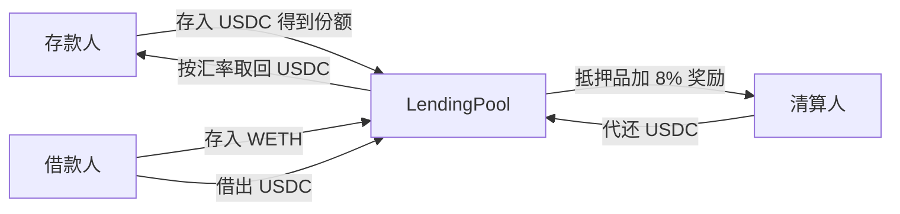

# Lending Pool Implementation Plan

> **For agentic workers:** REQUIRED SUB-SKILL: Use superpowers:subagent-driven-development (recommended) or superpowers:executing-plans to implement this plan task-by-task. Steps use checkbox (`- [ ]`) syntax for tracking.

**Goal:** 在 Foundry 项目里实现一个两种资产的教学借贷池，用 Compound Jump Rate 按秒计息，并让测试走完存款、借款、计息和清算。

**Architecture:** `JumpRateModel` 只算利率，`SimplePriceOracle` 只报价，`LendingPool` 持有全部业务状态。存款人存 USDC 得到份额，借款人存 WETH 再借 USDC。利息进入 `borrowIndex` 和总债务，其中 10% 记为储备金，其余抬高存款汇率。

**Tech Stack:** Solidity `^0.8.24`（foundry.toml 使用 solc 0.8.34）、Foundry、OpenZeppelin Contracts v5（`SafeERC20`、`Ownable`、`ReentrancyGuard`、`ERC20`）。

**Spec:** `docs/superpowers/specs/2026-09-26-lending-pool-design.md`

## Global Constraints

- 工作目录是 `bootcamp_2026_s3_vibe_coding_foundry`。下面的 `forge` 命令都从这里跑。
- `pragma solidity ^0.8.24;`，许可 `MIT`。OpenZeppelin 导入用 `@openzeppelin/contracts/...`。
- 演示代币都是 18 位小数。README 要写明：主网 USDC 是 6 位小数，这里用 18 位是为了让公式可读。
- 外部转账用 `SafeERC20`。会改状态的外部函数加 `nonReentrant`。先改存储再转账。
- 自定义 `error`。公开函数写中文 `/// @notice`。
- 利率是每秒 wad：`perSecond = aprWad / 31_536_000`，`31_536_000 = 365 days`。
- `BASE_APR = 0.02e18`，`MULTIPLIER_APR = 0.10e18`，`JUMP_MULTIPLIER_APR = 4.5e18`，`KINK = 0.80e18`。
- 抵押率 `0.75e18`，清算激励 `1.08e18`，close factor `0.50e18`，储备金比例 `0.10e18`。
- 初始价格：WETH `2000e18`，USDC `1e18`。
- 合约不会自己计息。状态变化和外部 `accrueInterest()` 才会滚动指数。
- 预言机是部署者可改的教学价格，不是 Chainlink，也不是 DEX 现货价。
- 总份额为 0 时汇率是 `1e18`。不防御空池通胀。
- 不做前端、原生 ETH、多市场、暂停、治理、坏账接管。

## File Structure

| 文件 | 职责 |
|---|---|
| `src/lending/MockERC20.sol` | 可任意 mint 的 18 位小数 ERC20 |
| `src/lending/JumpRateModel.sol` | 利用率 → 每秒借款利率，以及展示用的存款利率 |
| `src/lending/SimplePriceOracle.sol` | owner 设置的美元价格 |
| `src/lending/LendingPool.sol` | 存款、抵押、借款、还款、计息、清算、提取储备金 |
| `src/lending/README.md` | 链路、公式、示例数字、教学简化 |
| `test/lending/JumpRateModel.t.sol` | 拐点两侧利率 |
| `test/lending/LendingPool.t.sol` | 存借、计息、清算、权限 |
| `script/lending/DeployLendingPool.s.sol` | 部署全部合约并 `saveContract` |

每个任务结束时，该任务的测试通过，并且不改坏前面的测试。

---

### Task 1: MockERC20

**Files:**
- Create: `src/lending/MockERC20.sol`
- Test: `test/lending/MockERC20.t.sol`

**Interfaces:**
- Consumes: OpenZeppelin `ERC20`
- Produces: `constructor(string memory name, string memory symbol)`；`mint(address to, uint256 amount)` 无权限，18 位小数

- [ ] **Step 1: Write the failing test**

```solidity
// SPDX-License-Identifier: MIT
pragma solidity ^0.8.24;

import {Test} from "forge-std/Test.sol";
import {MockERC20} from "../../src/lending/MockERC20.sol";

contract MockERC20Test is Test {
    function test_mintIncreasesBalance() public {
        MockERC20 token = new MockERC20("USD Coin", "USDC");
        address alice = makeAddr("alice");

        token.mint(alice, 1_000e18);

        assertEq(token.decimals(), 18);
        assertEq(token.balanceOf(alice), 1_000e18);
        assertEq(token.totalSupply(), 1_000e18);
    }
}
```

- [ ] **Step 2: Run test to verify it fails**

Run: `forge test --match-path test/lending/MockERC20.t.sol -vv`

Expected: FAIL，编译错误，找不到 `MockERC20`

- [ ] **Step 3: Write minimal implementation**

```solidity
// SPDX-License-Identifier: MIT
pragma solidity ^0.8.24;

import {ERC20} from "@openzeppelin/contracts/token/ERC20/ERC20.sol";

/// @notice 演示用 ERC20。mint 无权限，只给本地测试和 anvil。
contract MockERC20 is ERC20 {
    constructor(string memory name, string memory symbol) ERC20(name, symbol) {}

    /// @notice 给 to 铸造 amount 个代币。
    function mint(address to, uint256 amount) external {
        _mint(to, amount);
    }
}
```

- [ ] **Step 4: Run test to verify it passes**

Run: `forge test --match-path test/lending/MockERC20.t.sol -vv`

Expected: PASS

- [ ] **Step 5: Commit**

```bash
git add src/lending/MockERC20.sol test/lending/MockERC20.t.sol
git commit -m "$(cat <<'EOF'
feat: add permissionless mock ERC20 for the lending demo

EOF
)"
```

---

### Task 2: JumpRateModel

**Files:**
- Create: `src/lending/JumpRateModel.sol`
- Test: `test/lending/JumpRateModel.t.sol`

**Interfaces:**
- Consumes: 无
- Produces:
  - `constructor(uint256 baseRatePerSecond, uint256 multiplierPerSecond, uint256 jumpMultiplierPerSecond, uint256 kink)`
  - `utilizationRate(uint256 cash, uint256 borrows, uint256 reserves) returns (uint256)`
  - `getBorrowRate(uint256 cash, uint256 borrows, uint256 reserves) returns (uint256)` 每秒 wad
  - `getSupplyRate(uint256 cash, uint256 borrows, uint256 reserves, uint256 reserveFactor) returns (uint256)`
  - `error InvalidKink()`

- [ ] **Step 1: Write the failing test**

```solidity
// SPDX-License-Identifier: MIT
pragma solidity ^0.8.24;

import {Test} from "forge-std/Test.sol";
import {JumpRateModel} from "../../src/lending/JumpRateModel.sol";

contract JumpRateModelTest is Test {
    uint256 internal constant SECONDS_PER_YEAR = 365 days;
    uint256 internal constant BASE_APR = 0.02e18;
    uint256 internal constant MULTIPLIER_APR = 0.10e18;
    uint256 internal constant JUMP_MULTIPLIER_APR = 4.5e18;
    uint256 internal constant KINK = 0.80e18;

    JumpRateModel internal model;

    function setUp() public {
        model = new JumpRateModel(
            BASE_APR / SECONDS_PER_YEAR,
            MULTIPLIER_APR / SECONDS_PER_YEAR,
            JUMP_MULTIPLIER_APR / SECONDS_PER_YEAR,
            KINK
        );
    }

    function test_borrowRateAtZeroUtilization() public view {
        assertEq(model.getBorrowRate(100e18, 0, 0), BASE_APR / SECONDS_PER_YEAR);
    }

    function test_borrowRateAtKink() public view {
        // 800 / 1000 = 80%
        uint256 rate = model.getBorrowRate(200e18, 800e18, 0);
        uint256 base = BASE_APR / SECONDS_PER_YEAR;
        uint256 multiplier = MULTIPLIER_APR / SECONDS_PER_YEAR;
        assertEq(rate, base + KINK * multiplier / 1e18);
    }

    function test_borrowRateAtFullUtilization() public view {
        uint256 rate = model.getBorrowRate(0, 100e18, 0);
        uint256 base = BASE_APR / SECONDS_PER_YEAR;
        uint256 multiplier = MULTIPLIER_APR / SECONDS_PER_YEAR;
        uint256 jump = JUMP_MULTIPLIER_APR / SECONDS_PER_YEAR;
        uint256 normal = base + KINK * multiplier / 1e18;
        assertEq(rate, normal + (1e18 - KINK) * jump / 1e18);
    }

    function test_rateAboveKinkIsHigherThanAtKink() public view {
        uint256 atKink = model.getBorrowRate(200e18, 800e18, 0);
        uint256 atNinety = model.getBorrowRate(100e18, 900e18, 0);
        assertGt(atNinety, atKink);
    }

    function test_slopeAboveKinkIsSteeper() public view {
        uint256 atZero = model.getBorrowRate(100e18, 0, 0);
        uint256 atKink = model.getBorrowRate(200e18, 800e18, 0);
        uint256 atFull = model.getBorrowRate(0, 100e18, 0);

        uint256 below = (atKink - atZero) * 1e18 / KINK;
        uint256 above = (atFull - atKink) * 1e18 / (1e18 - KINK);
        assertGt(above, below);
    }

    function test_supplyRateKeepsLenderShare() public view {
        uint256 borrowRate = model.getBorrowRate(200e18, 800e18, 0);
        uint256 util = model.utilizationRate(200e18, 800e18, 0);
        uint256 reserveFactor = 0.10e18;
        uint256 expected = borrowRate * util / 1e18 * (1e18 - reserveFactor) / 1e18;
        assertEq(model.getSupplyRate(200e18, 800e18, 0, reserveFactor), expected);
        assertLt(expected, borrowRate);
    }

    function test_zeroKinkReverts() public {
        vm.expectRevert(JumpRateModel.InvalidKink.selector);
        new JumpRateModel(0, 0, 0, 0);
    }
}
```

- [ ] **Step 2: Run test to verify it fails**

Run: `forge test --match-path test/lending/JumpRateModel.t.sol -vv`

Expected: FAIL，编译错误，找不到 `JumpRateModel`

- [ ] **Step 3: Write minimal implementation**

```solidity
// SPDX-License-Identifier: MIT
pragma solidity ^0.8.24;

/// @notice Compound Jump Rate：拐点以下一条斜率，拐点以上更陡。利率是每秒 wad。
contract JumpRateModel {
    uint256 internal constant WAD = 1e18;

    uint256 public immutable baseRatePerSecond;
    uint256 public immutable multiplierPerSecond;
    uint256 public immutable jumpMultiplierPerSecond;
    uint256 public immutable kink;

    error InvalidKink();

    constructor(
        uint256 baseRatePerSecond_,
        uint256 multiplierPerSecond_,
        uint256 jumpMultiplierPerSecond_,
        uint256 kink_
    ) {
        if (kink_ == 0 || kink_ > WAD) revert InvalidKink();
        baseRatePerSecond = baseRatePerSecond_;
        multiplierPerSecond = multiplierPerSecond_;
        jumpMultiplierPerSecond = jumpMultiplierPerSecond_;
        kink = kink_;
    }

    /// @notice 借款占「现金 + 借款 - 储备金」的比例，1e18 表示 100%。
    function utilizationRate(uint256 cash, uint256 borrows, uint256 reserves) public pure returns (uint256) {
        if (borrows == 0) return 0;
        uint256 denom = cash + borrows - reserves;
        if (denom == 0) return 0;
        return borrows * WAD / denom;
    }

    /// @notice 每秒借款利率，1e18 刻度。
    function getBorrowRate(uint256 cash, uint256 borrows, uint256 reserves) public view returns (uint256) {
        uint256 util = utilizationRate(cash, borrows, reserves);
        if (util <= kink) {
            return baseRatePerSecond + util * multiplierPerSecond / WAD;
        }
        uint256 normalRate = baseRatePerSecond + kink * multiplierPerSecond / WAD;
        return normalRate + (util - kink) * jumpMultiplierPerSecond / WAD;
    }

    /// @notice 展示用存款利率。池子不存储它，存款人靠汇率上涨获得利息。
    function getSupplyRate(uint256 cash, uint256 borrows, uint256 reserves, uint256 reserveFactor)
        public
        view
        returns (uint256)
    {
        uint256 borrowRate = getBorrowRate(cash, borrows, reserves);
        uint256 util = utilizationRate(cash, borrows, reserves);
        return borrowRate * util / WAD * (WAD - reserveFactor) / WAD;
    }
}
```

- [ ] **Step 4: Run test to verify it passes**

Run: `forge test --match-path test/lending/JumpRateModel.t.sol -vv`

Expected: PASS

- [ ] **Step 5: Commit**

```bash
git add src/lending/JumpRateModel.sol test/lending/JumpRateModel.t.sol
git commit -m "$(cat <<'EOF'
feat: add Compound-style jump rate model

EOF
)"
```

---

### Task 3: SimplePriceOracle

**Files:**
- Create: `src/lending/SimplePriceOracle.sol`
- Test: `test/lending/SimplePriceOracle.t.sol`

**Interfaces:**
- Consumes: OpenZeppelin `Ownable(address initialOwner)`
- Produces:
  - `constructor(address initialOwner)`
  - `setPrice(address asset, uint256 price)` only owner，`price == 0` 回滚
  - `getPrice(address asset) returns (uint256)`，未设置时为 0
  - `error ZeroPrice()`

- [ ] **Step 1: Write the failing test**

```solidity
// SPDX-License-Identifier: MIT
pragma solidity ^0.8.24;

import {Test} from "forge-std/Test.sol";
import {Ownable} from "@openzeppelin/contracts/access/Ownable.sol";
import {SimplePriceOracle} from "../../src/lending/SimplePriceOracle.sol";

contract SimplePriceOracleTest is Test {
    SimplePriceOracle internal oracle;
    address internal weth = makeAddr("weth");
    address internal alice = makeAddr("alice");

    function setUp() public {
        oracle = new SimplePriceOracle(address(this));
    }

    function test_ownerSetsPrice() public {
        oracle.setPrice(weth, 2000e18);
        assertEq(oracle.getPrice(weth), 2000e18);
    }

    function test_unsetPriceIsZero() public view {
        assertEq(oracle.getPrice(weth), 0);
    }

    function test_zeroPriceReverts() public {
        vm.expectRevert(SimplePriceOracle.ZeroPrice.selector);
        oracle.setPrice(weth, 0);
    }

    function test_nonOwnerCannotSetPrice() public {
        vm.prank(alice);
        vm.expectRevert(abi.encodeWithSelector(Ownable.OwnableUnauthorizedAccount.selector, alice));
        oracle.setPrice(weth, 2000e18);
    }
}
```

- [ ] **Step 2: Run test to verify it fails**

Run: `forge test --match-path test/lending/SimplePriceOracle.t.sol -vv`

Expected: FAIL，编译错误，找不到 `SimplePriceOracle`

- [ ] **Step 3: Write minimal implementation**

```solidity
// SPDX-License-Identifier: MIT
pragma solidity ^0.8.24;

import {Ownable} from "@openzeppelin/contracts/access/Ownable.sol";

/// @notice 教学预言机。价格是 1 个代币值多少美元，18 位小数。部署者可改价。
contract SimplePriceOracle is Ownable {
    mapping(address asset => uint256 price) public prices;

    error ZeroPrice();

    event PriceSet(address indexed asset, uint256 price);

    constructor(address initialOwner) Ownable(initialOwner) {}

    /// @notice 设置 asset 的美元价格。
    function setPrice(address asset, uint256 price) external onlyOwner {
        if (price == 0) revert ZeroPrice();
        prices[asset] = price;
        emit PriceSet(asset, price);
    }

    /// @notice 返回价格。没设过则为 0。
    function getPrice(address asset) external view returns (uint256) {
        return prices[asset];
    }
}
```

- [ ] **Step 4: Run test to verify it passes**

Run: `forge test --match-path test/lending/SimplePriceOracle.t.sol -vv`

Expected: PASS

- [ ] **Step 5: Commit**

```bash
git add src/lending/SimplePriceOracle.sol test/lending/SimplePriceOracle.t.sol
git commit -m "$(cat <<'EOF'
feat: add owner-set price oracle for the lending demo

EOF
)"
```

---

### Task 4: LendingPool 存款与取款

**Files:**
- Create: `src/lending/LendingPool.sol`
- Test: `test/lending/LendingPool.t.sol`

**Interfaces:**
- Consumes: `MockERC20`、`JumpRateModel`、`SimplePriceOracle.getPrice`、`JumpRateModel.getBorrowRate`
- Produces:
  - `constructor(IERC20 collateralToken, IERC20 borrowToken, SimplePriceOracle oracle, JumpRateModel model, uint256 collateralFactor, uint256 liquidationIncentive, uint256 closeFactor, uint256 reserveFactor, address initialOwner)`
  - `deposit(uint256 assets)`、`withdraw(uint256 assets)`
  - `cash() returns (uint256)`、`exchangeRate() returns (uint256)`
  - `accrueInterest()`
  - 状态：`totalShares`、`sharesOf`、`totalBorrows`、`totalReserves`、`borrowIndex`（初值 `1e18`）、`accrualTimestamp`
  - 本任务的 `_accrueInterest` 只把 `accrualTimestamp` 写成 `block.timestamp`。Task 6 换成真正的计息。
  - `error ZeroAmount()`、`ZeroShares()`、`InsufficientShares()`、`InsufficientCash()`、`IdenticalTokens()`、`InvalidParameter()`

- [ ] **Step 1: Write the failing test**

```solidity
// SPDX-License-Identifier: MIT
pragma solidity ^0.8.24;

import {Test} from "forge-std/Test.sol";
import {MockERC20} from "../../src/lending/MockERC20.sol";
import {JumpRateModel} from "../../src/lending/JumpRateModel.sol";
import {SimplePriceOracle} from "../../src/lending/SimplePriceOracle.sol";
import {LendingPool} from "../../src/lending/LendingPool.sol";

contract LendingPoolTest is Test {
    uint256 internal constant SECONDS_PER_YEAR = 365 days;

    MockERC20 internal collateral;
    MockERC20 internal borrowAsset;
    SimplePriceOracle internal oracle;
    JumpRateModel internal model;
    LendingPool internal pool;

    address internal alice = makeAddr("alice");
    address internal bob = makeAddr("bob");

    function setUp() public {
        collateral = new MockERC20("Wrapped Ether", "WETH");
        borrowAsset = new MockERC20("USD Coin", "USDC");
        oracle = new SimplePriceOracle(address(this));
        oracle.setPrice(address(collateral), 2000e18);
        oracle.setPrice(address(borrowAsset), 1e18);
        model = new JumpRateModel(
            0.02e18 / SECONDS_PER_YEAR,
            0.10e18 / SECONDS_PER_YEAR,
            4.5e18 / SECONDS_PER_YEAR,
            0.80e18
        );
        pool = new LendingPool(
            collateral,
            borrowAsset,
            oracle,
            model,
            0.75e18,
            1.08e18,
            0.50e18,
            0.10e18,
            address(this)
        );
    }

    function _deposit(address user, uint256 assets) internal {
        borrowAsset.mint(user, assets);
        vm.startPrank(user);
        borrowAsset.approve(address(pool), assets);
        pool.deposit(assets);
        vm.stopPrank();
    }

    function test_depositMintsOneToOneOnEmptyPool() public {
        _deposit(alice, 1_000e18);

        assertEq(pool.sharesOf(alice), 1_000e18);
        assertEq(pool.totalShares(), 1_000e18);
        assertEq(pool.exchangeRate(), 1e18);
        assertEq(pool.cash(), 1_000e18);
        assertEq(pool.borrowIndex(), 1e18);
    }

    function test_withdrawReturnsAssets() public {
        _deposit(alice, 1_000e18);

        vm.prank(alice);
        pool.withdraw(400e18);

        assertEq(borrowAsset.balanceOf(alice), 400e18);
        assertEq(pool.sharesOf(alice), 600e18);
        assertEq(pool.cash(), 600e18);
    }

    function test_withdrawRevertsWithoutShares() public {
        _deposit(alice, 100e18);

        vm.prank(bob);
        vm.expectRevert(LendingPool.InsufficientShares.selector);
        pool.withdraw(1);
    }

    function test_identicalTokensRevert() public {
        vm.expectRevert(LendingPool.IdenticalTokens.selector);
        new LendingPool(
            borrowAsset,
            borrowAsset,
            oracle,
            model,
            0.75e18,
            1.08e18,
            0.50e18,
            0.10e18,
            address(this)
        );
    }
}
```

- [ ] **Step 2: Run test to verify it fails**

Run: `forge test --match-path test/lending/LendingPool.t.sol -vv`

Expected: FAIL，编译错误，找不到 `LendingPool`

- [ ] **Step 3: Write minimal implementation**

写出下面的完整合约。抵押、借款、清算、储备金提取留到后面的任务。`_accrueInterest` 在本任务只更新时间戳。

```solidity
// SPDX-License-Identifier: MIT
pragma solidity ^0.8.24;

import {IERC20} from "@openzeppelin/contracts/token/ERC20/IERC20.sol";
import {SafeERC20} from "@openzeppelin/contracts/token/ERC20/utils/SafeERC20.sol";
import {Ownable} from "@openzeppelin/contracts/access/Ownable.sol";
import {ReentrancyGuard} from "@openzeppelin/contracts/utils/ReentrancyGuard.sol";
import {JumpRateModel} from "./JumpRateModel.sol";
import {SimplePriceOracle} from "./SimplePriceOracle.sol";

/// @notice 两种资产的教学借贷池。USDC 提供流动性，WETH 做抵押。
contract LendingPool is Ownable, ReentrancyGuard {
    using SafeERC20 for IERC20;

    uint256 internal constant WAD = 1e18;

    IERC20 public immutable collateralToken;
    IERC20 public immutable borrowToken;
    SimplePriceOracle public immutable oracle;
    JumpRateModel public immutable model;
    uint256 public immutable collateralFactor;
    uint256 public immutable liquidationIncentive;
    uint256 public immutable closeFactor;
    uint256 public immutable reserveFactor;

    uint256 public totalShares;
    mapping(address user => uint256 shares) public sharesOf;
    uint256 public totalBorrows;
    uint256 public totalReserves;
    uint256 public borrowIndex;
    uint256 public accrualTimestamp;

    error ZeroAmount();
    error ZeroShares();
    error InsufficientShares();
    error InsufficientCash();
    error IdenticalTokens();
    error InvalidParameter();

    event Deposit(address indexed user, uint256 assets, uint256 shares);
    event Withdraw(address indexed user, uint256 assets, uint256 shares);
    event AccrueInterest(uint256 borrowIndex, uint256 totalBorrows, uint256 totalReserves);

    constructor(
        IERC20 collateralToken_,
        IERC20 borrowToken_,
        SimplePriceOracle oracle_,
        JumpRateModel model_,
        uint256 collateralFactor_,
        uint256 liquidationIncentive_,
        uint256 closeFactor_,
        uint256 reserveFactor_,
        address initialOwner
    ) Ownable(initialOwner) {
        if (address(collateralToken_) == address(borrowToken_)) revert IdenticalTokens();
        if (collateralFactor_ == 0 || collateralFactor_ > WAD) revert InvalidParameter();
        if (liquidationIncentive_ < WAD) revert InvalidParameter();
        if (closeFactor_ == 0 || closeFactor_ > WAD) revert InvalidParameter();
        if (reserveFactor_ > WAD) revert InvalidParameter();

        collateralToken = collateralToken_;
        borrowToken = borrowToken_;
        oracle = oracle_;
        model = model_;
        collateralFactor = collateralFactor_;
        liquidationIncentive = liquidationIncentive_;
        closeFactor = closeFactor_;
        reserveFactor = reserveFactor_;
        borrowIndex = WAD;
        accrualTimestamp = block.timestamp;
    }

    /// @notice 池子里的可借资产余额。
    function cash() public view returns (uint256) {
        return borrowToken.balanceOf(address(this));
    }

    /// @notice 每份额可取回的可借资产。还没有份额时是 1:1。
    function exchangeRate() public view returns (uint256) {
        if (totalShares == 0) return WAD;
        return (cash() + totalBorrows - totalReserves) * WAD / totalShares;
    }

    /// @notice 把利息滚到当前时间。没人调用时利息不会自己增长。
    function accrueInterest() external nonReentrant {
        _accrueInterest();
    }

    /// @notice 存入可借资产，按当前汇率获得份额。
    function deposit(uint256 assets) external nonReentrant {
        _accrueInterest();
        if (assets == 0) revert ZeroAmount();
        uint256 shares = assets * WAD / exchangeRate();
        if (shares == 0) revert ZeroShares();
        totalShares += shares;
        sharesOf[msg.sender] += shares;
        emit Deposit(msg.sender, assets, shares);
        borrowToken.safeTransferFrom(msg.sender, address(this), assets);
    }

    /// @notice 按资产数量取回可借资产。烧掉的份额向上取整。
    function withdraw(uint256 assets) external nonReentrant {
        _accrueInterest();
        if (assets == 0) revert ZeroAmount();
        uint256 rate = exchangeRate();
        uint256 shares = (assets * WAD + rate - 1) / rate;
        if (sharesOf[msg.sender] < shares) revert InsufficientShares();
        if (cash() < assets) revert InsufficientCash();
        sharesOf[msg.sender] -= shares;
        totalShares -= shares;
        emit Withdraw(msg.sender, assets, shares);
        borrowToken.safeTransfer(msg.sender, assets);
    }

    /// @dev Task 6 replaces this with jump-rate accrual.
    function _accrueInterest() internal {
        accrualTimestamp = block.timestamp;
    }
}
```

- [ ] **Step 4: Run test to verify it passes**

Run: `forge test --match-path test/lending/LendingPool.t.sol -vv`

Expected: PASS

- [ ] **Step 5: Commit**

```bash
git add src/lending/LendingPool.sol test/lending/LendingPool.t.sol
git commit -m "$(cat <<'EOF'
feat: add lending pool deposits and withdrawals

EOF
)"
```

---

### Task 5: 抵押、借款、还款

**Files:**
- Modify: `src/lending/LendingPool.sol`
- Modify: `test/lending/LendingPool.t.sol`

**Interfaces:**
- Consumes: Task 4 的 `deposit`、`cash`、`exchangeRate`、`_accrueInterest`
- Produces:
  - `depositCollateral(uint256 amount)`、`withdrawCollateral(uint256 amount)`
  - `borrow(uint256 amount)`、`repay(address borrower, uint256 amount)`
  - `borrowBalanceStored(address user) returns (uint256)`
  - `getAccountLiquidity(address user) returns (uint256 liquidityUsd, uint256 shortfallUsd)`，不计入息
  - `collateralOf`、`principalOf`、`userIndexOf`
  - `error InsufficientCollateral()`、`Unhealthy()`、`ZeroPrice()`、`RepayExceedsDebt()`
  - 事件 `CollateralDeposited`、`CollateralWithdrawn`、`Borrow`、`Repay`

- [ ] **Step 1: Write the failing test**

把 `address internal carol = makeAddr("carol");` 加到 `LendingPoolTest` 的地址声明旁，再追加这些测试：

```solidity
    function _openBorrow(address lender, address borrower, uint256 supplied, uint256 collateralAmount, uint256 borrowed)
        internal
    {
        _deposit(lender, supplied);
        collateral.mint(borrower, collateralAmount);
        vm.startPrank(borrower);
        collateral.approve(address(pool), collateralAmount);
        pool.depositCollateral(collateralAmount);
        if (borrowed > 0) pool.borrow(borrowed);
        vm.stopPrank();
    }

    function test_borrowAtCollateralFactorSucceedsAndOneWeiReverts() public {
        _deposit(alice, 2_000e18);
        collateral.mint(bob, 1e18);
        vm.startPrank(bob);
        collateral.approve(address(pool), 1e18);
        pool.depositCollateral(1e18);
        pool.borrow(1_500e18);
        vm.expectRevert(LendingPool.Unhealthy.selector);
        pool.borrow(1);
        vm.stopPrank();

        assertEq(pool.borrowBalanceStored(bob), 1_500e18);
        assertEq(borrowAsset.balanceOf(bob), 1_500e18);
    }

    function test_withdrawCollateralThatBreaksHealthReverts() public {
        _openBorrow(alice, bob, 1_000e18, 1e18, 800e18);

        vm.prank(bob);
        vm.expectRevert(LendingPool.Unhealthy.selector);
        pool.withdrawCollateral(0.5e18);
    }

    function test_repayReducesDebt() public {
        _openBorrow(alice, bob, 1_000e18, 1e18, 800e18);
        borrowAsset.mint(carol, 100e18);

        vm.startPrank(carol);
        borrowAsset.approve(address(pool), 100e18);
        pool.repay(bob, 100e18);
        vm.stopPrank();

        assertEq(pool.borrowBalanceStored(bob), 700e18);
        assertEq(pool.totalBorrows(), 700e18);
    }

    function test_repayAllWithMaxUint() public {
        _openBorrow(alice, bob, 1_000e18, 1e18, 800e18);

        vm.startPrank(bob);
        borrowAsset.approve(address(pool), type(uint256).max);
        pool.repay(bob, type(uint256).max);
        vm.stopPrank();

        assertEq(pool.borrowBalanceStored(bob), 0);
        assertEq(pool.principalOf(bob), 0);
        assertEq(pool.totalBorrows(), 0);
    }

    function test_repayAboveDebtReverts() public {
        _openBorrow(alice, bob, 1_000e18, 1e18, 800e18);

        vm.startPrank(bob);
        borrowAsset.approve(address(pool), type(uint256).max);
        vm.expectRevert(LendingPool.RepayExceedsDebt.selector);
        pool.repay(bob, 800e18 + 1);
        vm.stopPrank();
    }

    function test_withdrawRevertsWhenCashInsufficient() public {
        _openBorrow(alice, bob, 1_000e18, 1e18, 800e18);

        vm.prank(alice);
        vm.expectRevert(LendingPool.InsufficientCash.selector);
        pool.withdraw(1_000e18);
    }
```

- [ ] **Step 2: Run test to verify it fails**

Run: `forge test --match-path test/lending/LendingPool.t.sol --match-test test_borrowAtCollateralFactorSucceedsAndOneWeiReverts -vv`

Expected: FAIL，编译错误，`LendingPool` 没有 `depositCollateral`

- [ ] **Step 3: Write minimal implementation**

在 `LendingPool` 里增加状态、错误和事件：

```solidity
    mapping(address user => uint256 amount) public collateralOf;
    mapping(address user => uint256 principal) public principalOf;
    mapping(address user => uint256 index) public userIndexOf;

    error InsufficientCollateral();
    error Unhealthy();
    error ZeroPrice();
    error RepayExceedsDebt();

    event CollateralDeposited(address indexed user, uint256 amount);
    event CollateralWithdrawn(address indexed user, uint256 amount);
    event Borrow(address indexed user, uint256 amount, uint256 debt, uint256 totalBorrows);
    event Repay(address indexed payer, address indexed borrower, uint256 amount, uint256 debt);
```

增加这些函数：

```solidity
    /// @notice 当前已记账债务。不含这次调用才应该滚上的利息。
    function borrowBalanceStored(address user) public view returns (uint256) {
        uint256 principal = principalOf[user];
        if (principal == 0) return 0;
        return principal * borrowIndex / userIndexOf[user];
    }

    /// @notice 借款额度减去债务。不调用计息。
    function getAccountLiquidity(address user) public view returns (uint256 liquidityUsd, uint256 shortfallUsd) {
        (uint256 collateralUsd, uint256 debtUsd, uint256 maxDebtUsd) =
            _usdValues(collateralOf[user], borrowBalanceStored(user));
        if (maxDebtUsd > debtUsd) liquidityUsd = maxDebtUsd - debtUsd;
        else shortfallUsd = debtUsd - maxDebtUsd;
    }

    /// @notice 存入抵押品。抵押品不计息。
    function depositCollateral(uint256 amount) external nonReentrant {
        _accrueInterest();
        if (amount == 0) revert ZeroAmount();
        collateralOf[msg.sender] += amount;
        emit CollateralDeposited(msg.sender, amount);
        collateralToken.safeTransferFrom(msg.sender, address(this), amount);
    }

    /// @notice 取回抵押品。取完后仓位必须仍然健康。
    function withdrawCollateral(uint256 amount) external nonReentrant {
        _accrueInterest();
        if (amount == 0) revert ZeroAmount();
        if (collateralOf[msg.sender] < amount) revert InsufficientCollateral();
        collateralOf[msg.sender] -= amount;
        _requireHealthy(collateralOf[msg.sender], borrowBalanceStored(msg.sender));
        emit CollateralWithdrawn(msg.sender, amount);
        collateralToken.safeTransfer(msg.sender, amount);
    }

    /// @notice 借出可借资产。新债务不能超过抵押品价值乘抵押率。
    function borrow(uint256 amount) external nonReentrant {
        _accrueInterest();
        if (amount == 0) revert ZeroAmount();
        if (cash() < amount) revert InsufficientCash();
        uint256 newDebt = borrowBalanceStored(msg.sender) + amount;
        _requireHealthy(collateralOf[msg.sender], newDebt);
        principalOf[msg.sender] = newDebt;
        userIndexOf[msg.sender] = borrowIndex;
        totalBorrows += amount;
        emit Borrow(msg.sender, amount, newDebt, totalBorrows);
        borrowToken.safeTransfer(msg.sender, amount);
    }

    /// @notice 替 borrower 偿还债务。amount 为 uint256 最大值时还清。
    function repay(address borrower, uint256 amount) external nonReentrant {
        _accrueInterest();
        uint256 debt = borrowBalanceStored(borrower);
        uint256 repayAmount = amount == type(uint256).max ? debt : amount;
        if (repayAmount == 0) revert ZeroAmount();
        if (repayAmount > debt) revert RepayExceedsDebt();
        _reduceDebt(borrower, debt, repayAmount);
        emit Repay(msg.sender, borrower, repayAmount, debt - repayAmount);
        borrowToken.safeTransferFrom(msg.sender, address(this), repayAmount);
    }

    function _reduceDebt(address borrower, uint256 debt, uint256 repayAmount) internal {
        uint256 newDebt = debt - repayAmount;
        principalOf[borrower] = newDebt == 0 ? 0 : newDebt;
        userIndexOf[borrower] = borrowIndex;
        totalBorrows -= repayAmount;
    }

    function _requireHealthy(uint256 collateralAmount, uint256 debt) internal view {
        (, uint256 debtUsd, uint256 maxDebtUsd) = _usdValues(collateralAmount, debt);
        if (debtUsd > maxDebtUsd) revert Unhealthy();
    }

    function _usdValues(uint256 collateralAmount, uint256 debt)
        internal
        view
        returns (uint256 collateralUsd, uint256 debtUsd, uint256 maxDebtUsd)
    {
        uint256 collateralPrice = oracle.getPrice(address(collateralToken));
        uint256 borrowPrice = oracle.getPrice(address(borrowToken));
        if (collateralPrice == 0 || borrowPrice == 0) revert ZeroPrice();
        collateralUsd = collateralAmount * collateralPrice / WAD;
        debtUsd = debt * borrowPrice / WAD;
        maxDebtUsd = collateralUsd * collateralFactor / WAD;
    }
```

- [ ] **Step 4: Run test to verify it passes**

Run: `forge test --match-path test/lending/LendingPool.t.sol -vv`

Expected: PASS，包括 Task 4 的旧测试

- [ ] **Step 5: Commit**

```bash
git add src/lending/LendingPool.sol test/lending/LendingPool.t.sol
git commit -m "$(cat <<'EOF'
feat: add collateralized borrow and repay

EOF
)"
```

---

### Task 6: 按秒计息

**Files:**
- Modify: `src/lending/LendingPool.sol` 中的 `_accrueInterest`
- Modify: `test/lending/LendingPool.t.sol`

**Interfaces:**
- Consumes: `model.getBorrowRate(cash, totalBorrows, totalReserves)`，Task 5 的借款记账
- Produces: `_accrueInterest` 按规格更新 `totalBorrows`、`totalReserves`、`borrowIndex`、`accrualTimestamp`，并发出 `AccrueInterest`

- [ ] **Step 1: Write the failing test**

追加到 `LendingPool.t.sol`：

```solidity
    function test_interestIncreasesDebtReservesAndExchangeRate() public {
        _openBorrow(alice, bob, 1_000e18, 1e18, 800e18);
        uint256 rate = model.getBorrowRate(pool.cash(), pool.totalBorrows(), pool.totalReserves());

        vm.warp(block.timestamp + SECONDS_PER_YEAR);
        uint256 interest = 800e18 * rate * SECONDS_PER_YEAR / 1e18;
        pool.accrueInterest();

        assertEq(pool.totalBorrows(), 800e18 + interest);
        assertEq(pool.borrowBalanceStored(bob), 800e18 + interest);
        assertEq(pool.totalReserves(), interest * 0.10e18 / 1e18);
        assertGt(pool.exchangeRate(), 1e18);
    }

    function test_laterDepositorReceivesFewerSharesAfterInterest() public {
        _openBorrow(alice, bob, 1_000e18, 1e18, 800e18);
        vm.warp(block.timestamp + SECONDS_PER_YEAR);
        pool.accrueInterest();

        _deposit(carol, 1_000e18);

        assertEq(pool.sharesOf(alice), 1_000e18);
        assertLt(pool.sharesOf(carol), 1_000e18);
    }

    function test_indexGrowsFasterAboveKink() public {
        _openBorrow(alice, bob, 1_000e18, 1e18, 800e18);

        LendingPool high = new LendingPool(
            collateral, borrowAsset, oracle, model, 0.75e18, 1.08e18, 0.50e18, 0.10e18, address(this)
        );
        borrowAsset.mint(alice, 1_000e18);
        vm.startPrank(alice);
        borrowAsset.approve(address(high), 1_000e18);
        high.deposit(1_000e18);
        vm.stopPrank();
        collateral.mint(bob, 1e18);
        vm.startPrank(bob);
        collateral.approve(address(high), 1e18);
        high.depositCollateral(1e18);
        high.borrow(900e18);
        vm.stopPrank();

        vm.warp(block.timestamp + SECONDS_PER_YEAR);
        pool.accrueInterest();
        high.accrueInterest();

        assertGt(high.borrowIndex() - 1e18, pool.borrowIndex() - 1e18);
    }
```

- [ ] **Step 2: Run test to verify it fails**

Run: `forge test --match-path test/lending/LendingPool.t.sol --match-test test_interestIncreasesDebtReservesAndExchangeRate -vv`

Expected: FAIL，`totalBorrows` 仍是 `800e18`，因为 `_accrueInterest` 还没加利息

- [ ] **Step 3: Write minimal implementation**

把 `_accrueInterest` 整段换成：

```solidity
    function _accrueInterest() internal {
        uint256 delta = block.timestamp - accrualTimestamp;
        if (delta == 0) return;

        uint256 borrowRate = model.getBorrowRate(cash(), totalBorrows, totalReserves);
        uint256 interest = totalBorrows * borrowRate * delta / WAD;
        totalBorrows += interest;
        totalReserves += interest * reserveFactor / WAD;
        borrowIndex += borrowIndex * borrowRate * delta / WAD;
        accrualTimestamp = block.timestamp;
        emit AccrueInterest(borrowIndex, totalBorrows, totalReserves);
    }
```

- [ ] **Step 4: Run test to verify it passes**

Run: `forge test --match-path test/lending/LendingPool.t.sol -vv`

Expected: PASS

- [ ] **Step 5: Commit**

```bash
git add src/lending/LendingPool.sol test/lending/LendingPool.t.sol
git commit -m "$(cat <<'EOF'
feat: accrue jump-rate interest on lending pool balances

EOF
)"
```

---

### Task 7: 清算

**Files:**
- Modify: `src/lending/LendingPool.sol`
- Modify: `test/lending/LendingPool.t.sol`

**Interfaces:**
- Consumes: `borrowBalanceStored`、`getAccountLiquidity`、`_reduceDebt`、`collateralOf`、`oracle.getPrice`
- Produces:
  - `liquidate(address borrower, uint256 repayAmount)`
  - `error NoDebt()`、`NoShortfall()`、`RepayExceedsCloseFactor()`、`ZeroSeize()`、`SeizeExceedsCollateral()`
  - 事件 `Liquidate(address indexed liquidator, address indexed borrower, uint256 repayAmount, uint256 seizeAmount)`

- [ ] **Step 1: Write the failing test**

把 `address internal liquidator = makeAddr("liquidator");` 加到地址声明旁，再追加：

```solidity
    function test_liquidateRevertsWhenHealthy() public {
        _openBorrow(alice, bob, 1_000e18, 1e18, 800e18);
        borrowAsset.mint(liquidator, 400e18);

        vm.startPrank(liquidator);
        borrowAsset.approve(address(pool), 400e18);
        vm.expectRevert(LendingPool.NoShortfall.selector);
        pool.liquidate(bob, 400e18);
        vm.stopPrank();
    }

    function test_liquidateSeizesBonusCollateral() public {
        _openBorrow(alice, bob, 1_000e18, 1e18, 800e18);
        oracle.setPrice(address(collateral), 500e18);
        borrowAsset.mint(liquidator, 400e18);

        vm.startPrank(liquidator);
        borrowAsset.approve(address(pool), 400e18);
        pool.liquidate(bob, 400e18);
        vm.stopPrank();

        assertEq(pool.borrowBalanceStored(bob), 400e18);
        assertEq(pool.collateralOf(bob), 1e18 - 0.864e18);
        assertEq(collateral.balanceOf(liquidator), 0.864e18);
        assertEq(pool.totalBorrows(), 400e18);
    }

    function test_liquidateRevertsAboveCloseFactor() public {
        _openBorrow(alice, bob, 1_000e18, 1e18, 800e18);
        oracle.setPrice(address(collateral), 500e18);
        borrowAsset.mint(liquidator, 400e18 + 1);

        vm.startPrank(liquidator);
        borrowAsset.approve(address(pool), 400e18 + 1);
        vm.expectRevert(LendingPool.RepayExceedsCloseFactor.selector);
        pool.liquidate(bob, 400e18 + 1);
        vm.stopPrank();
    }

    function test_fullCloseRevertsWhenSeizeExceedsCollateralButSmallerRepayWorks() public {
        _openBorrow(alice, bob, 1_000e18, 1e18, 800e18);
        oracle.setPrice(address(collateral), 100e18);
        borrowAsset.mint(liquidator, 400e18);

        vm.startPrank(liquidator);
        borrowAsset.approve(address(pool), 400e18);
        vm.expectRevert(LendingPool.SeizeExceedsCollateral.selector);
        pool.liquidate(bob, 400e18);

        pool.liquidate(bob, 90e18);
        vm.stopPrank();

        assertEq(pool.borrowBalanceStored(bob), 710e18);
        assertEq(collateral.balanceOf(liquidator), 0.972e18);
    }
```

- [ ] **Step 2: Run test to verify it fails**

Run: `forge test --match-path test/lending/LendingPool.t.sol --match-test test_liquidateSeizesBonusCollateral -vv`

Expected: FAIL，编译错误，没有 `liquidate`

- [ ] **Step 3: Write minimal implementation**

增加错误和事件：

```solidity
    error NoDebt();
    error NoShortfall();
    error RepayExceedsCloseFactor();
    error ZeroSeize();
    error SeizeExceedsCollateral();

    event Liquidate(address indexed liquidator, address indexed borrower, uint256 repayAmount, uint256 seizeAmount);
```

增加函数：

```solidity
    /// @notice 仓位已有短亏时，代还最多 close factor 的债务，并按激励拿走抵押品。
    function liquidate(address borrower, uint256 repayAmount) external nonReentrant {
        _accrueInterest();
        uint256 debt = borrowBalanceStored(borrower);
        if (debt == 0) revert NoDebt();
        (, uint256 shortfallUsd) = getAccountLiquidity(borrower);
        if (shortfallUsd == 0) revert NoShortfall();

        uint256 maxRepay = debt * closeFactor / WAD;
        if (repayAmount == 0) revert ZeroAmount();
        if (repayAmount > maxRepay) revert RepayExceedsCloseFactor();

        uint256 borrowPrice = oracle.getPrice(address(borrowToken));
        uint256 collateralPrice = oracle.getPrice(address(collateralToken));
        if (borrowPrice == 0 || collateralPrice == 0) revert ZeroPrice();

        uint256 repayUsd = repayAmount * borrowPrice / WAD;
        uint256 seizeUsd = repayUsd * liquidationIncentive / WAD;
        uint256 seize = seizeUsd * WAD / collateralPrice;
        if (seize == 0) revert ZeroSeize();
        if (seize > collateralOf[borrower]) revert SeizeExceedsCollateral();

        collateralOf[borrower] -= seize;
        _reduceDebt(borrower, debt, repayAmount);
        emit Liquidate(msg.sender, borrower, repayAmount, seize);
        collateralToken.safeTransfer(msg.sender, seize);
        borrowToken.safeTransferFrom(msg.sender, address(this), repayAmount);
    }
```

- [ ] **Step 4: Run test to verify it passes**

Run: `forge test --match-path test/lending/LendingPool.t.sol -vv`

Expected: PASS

- [ ] **Step 5: Commit**

```bash
git add src/lending/LendingPool.sol test/lending/LendingPool.t.sol
git commit -m "$(cat <<'EOF'
feat: liquidate undercollateralized lending positions

EOF
)"
```

---

### Task 8: 提取储备金

**Files:**
- Modify: `src/lending/LendingPool.sol`
- Modify: `test/lending/LendingPool.t.sol`

**Interfaces:**
- Consumes: `totalReserves`、`cash`、`exchangeRate`、`onlyOwner`
- Produces: `reduceReserves(uint256 amount)` only owner；`error InsufficientReserves()`；事件 `ReservesReduced(address indexed to, uint256 amount)`

- [ ] **Step 1: Write the failing test**

测试文件顶部增加 `import {Ownable} from "@openzeppelin/contracts/access/Ownable.sol";`，再追加：

```solidity
    function test_reduceReservesPaysOwnerWithoutChangingExchangeRate() public {
        _openBorrow(alice, bob, 1_000e18, 1e18, 800e18);
        vm.warp(block.timestamp + SECONDS_PER_YEAR);
        pool.accrueInterest();

        uint256 reserves = pool.totalReserves();
        uint256 rateBefore = pool.exchangeRate();
        uint256 ownerBefore = borrowAsset.balanceOf(address(this));

        pool.reduceReserves(reserves);

        assertEq(pool.totalReserves(), 0);
        assertEq(pool.exchangeRate(), rateBefore);
        assertEq(borrowAsset.balanceOf(address(this)), ownerBefore + reserves);
    }

    function test_nonOwnerCannotReduceReserves() public {
        vm.prank(alice);
        vm.expectRevert(abi.encodeWithSelector(Ownable.OwnableUnauthorizedAccount.selector, alice));
        pool.reduceReserves(1);
    }
```

- [ ] **Step 2: Run test to verify it fails**

Run: `forge test --match-path test/lending/LendingPool.t.sol --match-test test_reduceReservesPaysOwnerWithoutChangingExchangeRate -vv`

Expected: FAIL，编译错误，没有 `reduceReserves`

- [ ] **Step 3: Write minimal implementation**

```solidity
    error InsufficientReserves();

    event ReservesReduced(address indexed to, uint256 amount);

    /// @notice 把记账的储备金转给 owner。现金和储备金同减，存款汇率不变。
    function reduceReserves(uint256 amount) external onlyOwner nonReentrant {
        _accrueInterest();
        if (amount == 0) revert ZeroAmount();
        if (amount > totalReserves) revert InsufficientReserves();
        if (amount > cash()) revert InsufficientCash();
        totalReserves -= amount;
        emit ReservesReduced(msg.sender, amount);
        borrowToken.safeTransfer(msg.sender, amount);
    }
```

- [ ] **Step 4: Run test to verify it passes**

Run: `forge test --match-path test/lending/*.t.sol -vv`

Expected: PASS

- [ ] **Step 5: Commit**

```bash
git add src/lending/LendingPool.sol test/lending/LendingPool.t.sol
git commit -m "$(cat <<'EOF'
feat: let the pool owner withdraw accounted reserves

EOF
)"
```

---

### Task 9: README 与部署脚本

**Files:**
- Create: `src/lending/README.md`
- Create: `script/lending/DeployLendingPool.s.sol`

**Interfaces:**
- Consumes: Task 1–8 的全部构造函数
- Produces: 文档，以及 `DeployLendingPool.run()`。脚本继承 `script/BaseScript.s.sol` 的 `BaseScript`，在 `broadcaster` 里 `saveContract`

- [ ] **Step 1: Write the README**

把下面的内容写入 `src/lending/README.md`。

````markdown
# 教学借贷池

一个资金池、两种 18 位小数的 ERC20。存款人存入 USDC 得到份额，借款人存入 WETH 再借出 USDC。利率曲线是 Compound 的 Jump Rate，时间单位是秒，测试用 `vm.warp`。

主网 USDC 是 6 位小数。这里改成 18 位，是为了让「数量 × 价格 / 1e18」直接得到美元，避免小数位把原理挡住。

预言机是部署者调用 `setPrice` 改出来的教学价格，不是 Chainlink，也不是 DEX 现货价。

合约不会自己计息。有人调用存款、取款、抵押、借款、还款、清算、`accrueInterest` 或 `reduceReserves` 时，才把上次到现在的利息一次算完。

## 合约

| 合约 | 作用 |
|---|---|
| `MockERC20` | 可任意铸造的 WETH / USDC |
| `JumpRateModel` | 由现金、总借款、储备金算出每秒借款利率 |
| `SimplePriceOracle` | 1 个代币值多少美元，18 位小数 |
| `LendingPool` | 存款、抵押、借款、还款、清算 |



## 利率

```text
utilization = totalBorrows / (cash + totalBorrows - reserves)

util ≤ 80%:  年化 = 2% + util × 10%
util > 80%:  年化 = 10% + (util - 80%) × 450%
```

80% 利用率时借款年化是 10%，100% 时是 100%。合约里存的是这个年化除以 `365 days` 的每秒利率。

借款人保存本金和当时的 `borrowIndex`：

```text
debt = principal × borrowIndex / userIndex
```

新产生的利息有 10% 记入 `totalReserves`，另外 90% 留在「现金 + 总借款 - 储备金」里，所以存款汇率上升：

```text
exchangeRate = (cash + totalBorrows - reserves) / totalShares
```

还没有份额时，汇率按 1:1。这挡不住空池通胀；演示时先存入流动性再借款。

## 偿付与清算

抵押率 75%。1 WETH 价格 2000 美元时，最多借 1500 USDC。

已经资不抵债才能清算。一笔最多代还当前债务的 50%。清算人拿到的抵押品，按所还债务的美元价值再多 8%。要拿走的抵押品超过余额时，整笔交易回滚，协议不接收坏账。

示例：池内 1000 USDC，借出 800，抵押 1 WETH。价格跌到 500 美元时，代还 400 USDC，清算人得到 0.864 WETH。

`reduceReserves` 把储备金转给 owner。转出的 USDC 和记账储备金同时减少，存款汇率不变。
````

- [ ] **Step 2: Write the deploy script**

```solidity
// SPDX-License-Identifier: MIT
pragma solidity ^0.8.24;

// ---------------------------------------------------------------------------
// LendingPool — 教学借贷池
// 部署 WETH、USDC、预言机、Jump Rate 和资金池。
//
// forge script script/lending/DeployLendingPool.s.sol:DeployLendingPool \
//   --broadcast --rpc-url local \
//   --private-key 0xac0974bec39a17e36ba4a6b4d238ff944bacb478cbed5efcae784d7bf4f2ff80 \
//   && cat ./deployments/LATEST.txt
// ---------------------------------------------------------------------------

import {console} from "forge-std/Script.sol";
import {BaseScript} from "../BaseScript.s.sol";
import {MockERC20} from "../../src/lending/MockERC20.sol";
import {JumpRateModel} from "../../src/lending/JumpRateModel.sol";
import {SimplePriceOracle} from "../../src/lending/SimplePriceOracle.sol";
import {LendingPool} from "../../src/lending/LendingPool.sol";

contract DeployLendingPool is BaseScript {
    uint256 internal constant SECONDS_PER_YEAR = 365 days;

    function run() public broadcaster {
        MockERC20 weth = new MockERC20("Wrapped Ether", "WETH");
        MockERC20 usdc = new MockERC20("USD Coin", "USDC");

        SimplePriceOracle oracle = new SimplePriceOracle(deployer);
        oracle.setPrice(address(weth), 2000e18);
        oracle.setPrice(address(usdc), 1e18);

        JumpRateModel model = new JumpRateModel({
            baseRatePerSecond_: 0.02e18 / SECONDS_PER_YEAR,
            multiplierPerSecond_: 0.10e18 / SECONDS_PER_YEAR,
            jumpMultiplierPerSecond_: 4.5e18 / SECONDS_PER_YEAR,
            kink_: 0.80e18
        });

        LendingPool pool = new LendingPool(
            weth,
            usdc,
            oracle,
            model,
            0.75e18,
            1.08e18,
            0.50e18,
            0.10e18,
            deployer
        );

        saveContract("WETH", address(weth));
        saveContract("USDC", address(usdc));
        saveContract("SimplePriceOracle", address(oracle));
        saveContract("JumpRateModel", address(model));
        saveContract("LendingPool", address(pool));

        console.log("WETH:            ", address(weth));
        console.log("USDC:            ", address(usdc));
        console.log("SimplePriceOracle", address(oracle));
        console.log("JumpRateModel:   ", address(model));
        console.log("LendingPool:     ", address(pool));
    }
}
```

构造函数参数名必须和 `JumpRateModel` 里的 `baseRatePerSecond_`、`multiplierPerSecond_`、`jumpMultiplierPerSecond_`、`kink_` 一致。

- [ ] **Step 3: Compile**

Run: `forge build`

Expected: 编译成功，没有 error

- [ ] **Step 4: Run the full lending tests**

Run: `forge test --match-path test/lending/*.t.sol -vv`

Expected: PASS

- [ ] **Step 5: Commit**

```bash
git add src/lending/README.md script/lending/DeployLendingPool.s.sol
git commit -m "$(cat <<'EOF'
docs: explain the lending pool and add its deploy script

EOF
)"
```
