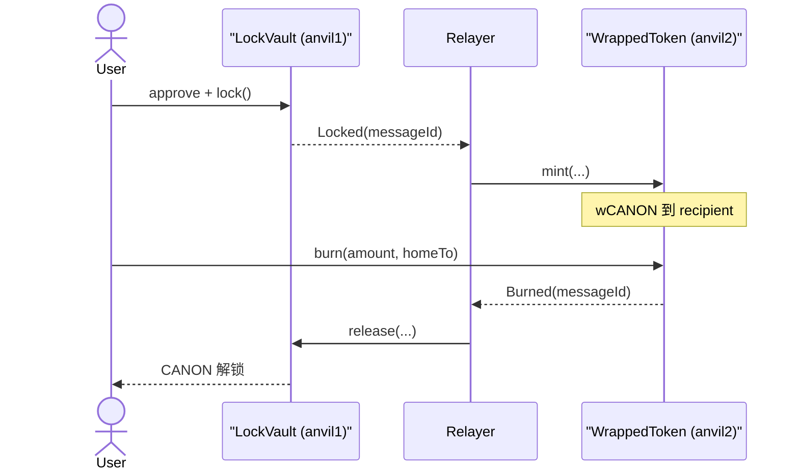

# Trusted Relayer Lock-and-Mint Demo

用三份极简合约演示 **资产跨链的本质：一边锁、一边铸包装资产**。

- **`forge test`**：仍在同一条内存 EVM 上跑，靠构造函数里的逻辑 domain（`1` / `2`）区分两端，不用 `block.chainid`。
- **本地走通**：两个 Anvil（不同端口、不同 chain id），`lock`/`release` 打 `anvil1`，`mint`/`burn` 打 `anvil2`。Relayer 就是你换 RPC 发交易。

**信任模型：本 demo 等于中心化预言机。** Relayer 说「源链锁过了」，目标链就铸币。生产桥的差异全在如何降低对搬运工的信任（轻客户端、乐观挑战、ZK、官方 L1↔L2 桥），本仓库不实现那些。

## 心智模型（代币不会飞过去）

智能合约不能打给另一条链。`LockVault` 锁币后只会 `emit Locked`。必须有人（relayer）去 `WrappedToken.mint`。没人调用，目标链余额永远是 0。



| 谁调用 | 做什么 | 没人调用会怎样 |
|--------|--------|----------------|
| 用户 `lock` | 原币锁进金库，发出 `Locked` | 无跨链意图 |
| 仅 relayer `mint` | 按消息铸包装币 | 金库锁着，对端余额不变 |
| 用户 `burn` | 销毁包装币，发出 `Burned` | 包装币还在用户手里 |
| 仅 relayer `release` | 按销毁消息解锁原币 | 原币继续锁在金库（包装币已烧则两边都不在用户手里） |
| owner `setRelayer` | 换搬运工 | 旧 relayer 不能再 mint/release |

`messageId = keccak256(abi.encode(srcDomain, destDomain, nonce, sender, recipient, amount))`。接收端用 `s_processed[messageId]` 防重放。

逻辑 domain `1`/`2` 和 Anvil 的 `--chain-id 31337`/`31338` 不是一回事：合约不读 `block.chainid`。

不变量（诚实 relayer、无人直接打币进金库时）：

- `token.balanceOf(vault) == vault.s_locked()`
- 锁仓且已 mint、尚未 burn：`wrapped.totalSupply() == vault.s_locked()`
- 已 burn、尚未 release：供给为 0，金库仍锁着，直到 relayer `release`

Relayer 仍可在**没有**对应 `Locked` 的情况下凭空 `mint`（信任边界）。`s_locked` 会挡住「假 release 掏走超过真实锁仓的原币」。

## 合约

- [`CanonicalToken.sol`](./CanonicalToken.sol)：源链原币，18 decimals，部署时 mint `1_000_000e18` 给部署者。
- [`LockVault.sol`](./LockVault.sol)：`lock` / `release`，记录 `s_locked`。
- [`WrappedToken.sol`](./WrappedToken.sol)：桥控制的 `mint` / 用户 `burn`。

刻意不共用库：和消息跨链 demo 对照时，重复的 nonce / `onlyRelayer` / 重放保护就是重点。

## 本地测试

```bash
cd bootcamp_2026_s3_vibe_coding_foundry
forge test --match-path 'test/crosschain_lock_mint/*' -vv
```

测试合约扮演 relayer：读 `lock`/`burn` 的 nonce，再 `prank(relayer)` 调对端。覆盖往返、重放、非 relayer、amount=0、relayer 停机、换 relayer。

## 两个 Anvil 走通

网络别名在 `foundry.toml`，且必须写进 `.env` 的 `FOUNDRY_RPC_ENDPOINTS`（Foundry 1.x 会用这条环境变量整表覆盖 `[rpc_endpoints]`）。

| 别名 | RPC | chain id | 部署 |
|------|-----|----------|------|
| `anvil1` | `http://127.0.0.1:8545` | 31337 | CanonicalToken + LockVault |
| `anvil2` | `http://127.0.0.1:8546` | 31338 | WrappedToken |

默认 domain：home `1`，remote `2`。Relayer 默认等于部署者。两边用同一把 Anvil Account #0（`.env` 里的 `OWNER1_PRIVATE_KEY`），两个节点都会给这个地址发 ETH。

两次部署会分别覆盖 `deployments/LATEST.txt`，以带 chain id 的 json 为准。

```bash
cd bootcamp_2026_s3_vibe_coding_foundry
set -a && source .env && set +a

# 终端 1
anvil --port 8545 --chain-id 31337

# 终端 2
anvil --port 8546 --chain-id 31338

# 终端 3：源链
forge script script/crosschain_lock_mint/DeployLockMint.s.sol --broadcast \
  --rpc-url anvil1 --private-key $OWNER1_PRIVATE_KEY
cat deployments/CanonicalToken/CanonicalToken_31337.json
cat deployments/LockVault/LockVault_31337.json

# 目标链
forge script script/crosschain_lock_mint/DeployLockMintRemote.s.sol --broadcast \
  --rpc-url anvil2 --private-key $OWNER1_PRIVATE_KEY
cat deployments/WrappedToken/WrappedToken_31338.json
```

把 json 里的 `address` 填进环境变量（`USER` 用 Anvil Account #0：`0xf39Fd6e51aad88F6F4ce6aB8827279cffFb92266`）：

```bash
export TOKEN=<CanonicalToken>
export VAULT=<LockVault>
export WRAPPED=<WrappedToken>
export USER=0xf39Fd6e51aad88F6F4ce6aB8827279cffFb92266

cast send $TOKEN "approve(address,uint256)" $VAULT 100ether \
  --rpc-url anvil1 --private-key $OWNER1_PRIVATE_KEY
cast send $VAULT "lock(address,uint256)" $USER 100ether \
  --rpc-url anvil1 --private-key $OWNER1_PRIVATE_KEY

# 第一笔 lock 的 nonce 为 1；sender/recipient 都是 USER
cast send $WRAPPED "mint(uint64,uint64,uint64,address,address,uint256)" \
  1 2 1 $USER $USER 100ether \
  --rpc-url anvil2 --private-key $OWNER1_PRIVATE_KEY

cast send $WRAPPED "burn(uint256,address)" 100ether $USER \
  --rpc-url anvil2 --private-key $OWNER1_PRIVATE_KEY
cast send $VAULT "release(uint64,uint64,uint64,address,address,uint256)" \
  2 1 1 $USER $USER 100ether \
  --rpc-url anvil1 --private-key $OWNER1_PRIVATE_KEY
```

可选覆盖：`LOCK_MINT_RELAYER` / `LOCK_MINT_HOME` / `LOCK_MINT_REMOTE`（两个部署脚本要设成同一组）。

## 刻意不做

- 不做前端
- 不做轻客户端 / Merkle proof / 乐观挑战 / ZK
- 不接 CCIP / LayerZero
- 不收桥费、不多 hop、不上真实双测试网
- 不把 `block.chainid` 当 domain（即使 Anvil 已是 31337 / 31338）
