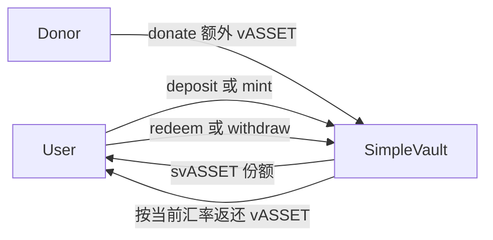
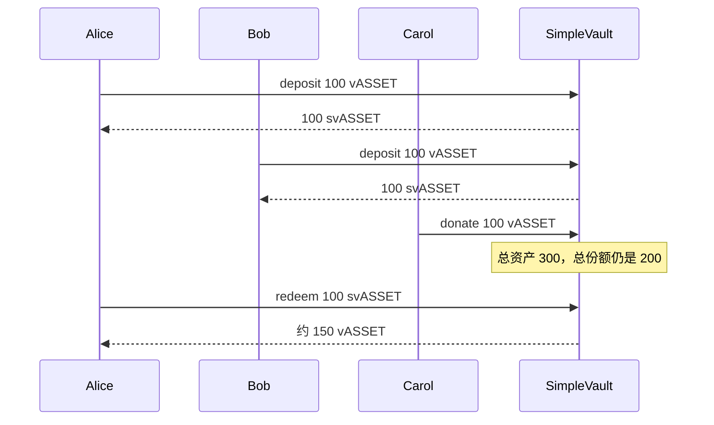

# ERC-4626 储蓄金库 Demo

用 OpenZeppelin [`ERC4626`](https://github.com/OpenZeppelin/openzeppelin-contracts/blob/master/contracts/token/ERC20/extensions/ERC4626.sol)（本仓库 `lib/openzeppelin-contracts`，v5.7.0）做一个最小金库：**存入底层资产，得到份额代币；有人多转资产进来但不增发份额时，每个份额更值钱。**

`deposit` / `mint` / `withdraw` / `redeem` 和汇率都走父合约，没有改 `_convertToShares` 或 `_decimalsOffset()`。

## 两笔资产

| 合约 | 代币 | 角色 |
|------|------|------|
| [`VaultAsset.sol`](./VaultAsset.sol) | vASSET | 底层资产。`mint` 无权限，只给本地测试和 anvil |
| [`SimpleVault.sol`](./SimpleVault.sol) | svASSET | 金库份额。持有它就是对金库里 vASSET 的按比例索取权 |



## 汇率

OpenZeppelin 用金库余额当 `totalAssets()`。份额供给不变时，余额变多，一份额能换回的资产就变多。

默认还有 1 个虚拟资产、1 个虚拟份额（`_decimalsOffset()` 为 0），所以空金库第一次存款仍是 1:1，同时让「先捐赠再让后来者存款」没那么容易偷走全部本金。

```text
shares = assets * (totalSupply + 1) / (totalAssets + 1)   // 向下取整
assets = shares * (totalAssets + 1) / (totalSupply + 1)   // 赎回向下取整
```

`mint` / `withdraw` 用向上取整，避免少付资产或多拿资产。



`donate` 只做 `transferFrom` 并发出 `Donated`。它不铸造份额，所以捐赠者自己拿不回这笔钱，收益归当时的份额持有人。

## 四条标准入口

资产从调用者 `msg.sender` 转入。份额记在参数指定的地址上，不必是调用者本人。

`deposit(uint256 assets, address receiver) returns (uint256 shares)`

- `assets`：调用者存入的 vASSET 数量
- `receiver`：收到 svASSET 的地址
- 返回值 `shares`：实际铸给 `receiver` 的份额数量

`mint(uint256 shares, address receiver) returns (uint256 assets)`

- `shares`：要铸给 `receiver` 的 svASSET 数量
- `receiver`：收到这些份额的地址
- 返回值 `assets`：调用者为了拿到这些份额，实际付出的 vASSET 数量

`withdraw(uint256 assets, address receiver, address owner) returns (uint256 shares)`

- `assets`：要从金库取出的 vASSET 数量
- `receiver`：收到这些 vASSET 的地址
- `owner`：份额从谁的余额里烧掉。调用者不是 `owner` 时，需要 `owner` 事先 `approve` 份额
- 返回值 `shares`：为了取出这些资产，实际烧掉的份额数量

`redeem(uint256 shares, address receiver, address owner) returns (uint256 assets)`

- `shares`：从 `owner` 烧掉的 svASSET 数量
- `receiver`：收到 vASSET 的地址
- `owner`：份额从谁的余额里烧掉。调用者不是 `owner` 时，需要 `owner` 事先 `approve` 份额
- 返回值 `assets`：`receiver` 实际收到的 vASSET 数量

链上调用前用同名的 `preview*` 看报价。`preview*` 与真实到账在本 demo 的测试里是一致的。

## 本地测试

```bash
cd bootcamp_2026_s3_vibe_coding_foundry
forge test --match-path test/erc-4626/SimpleVault.t.sol -vv
```

覆盖：空金库 1:1 存款、`donate` 不增发且抬价、后来的存款人份额更少、按份额赎回本金加收益、`mint` / `withdraw` 与 `preview*` 一致、`donate(0)` 回退。

## 本地部署

```bash
forge script script/erc-4626/DeploySimpleVault.s.sol:DeploySimpleVault \
  --broadcast --rpc-url local \
  --private-key 0xac0974bec39a17e36ba4a6b4d238ff944bacb478cbed5efcae784d7bf4f2ff80 \
  && cat ./deployments/LATEST.txt
```

部署 `VaultAsset` 和 `SimpleVault`。anvil 默认私钥只用于本地。

## 使用时注意

存款前先看 `previewDeposit`。它用同一条汇率公式，只报价、不转账。返回值是 0 就不要调用 `deposit`。

空金库时 `totalSupply = 0`、`totalAssets = 0`，`shares = assets * 1 / 1`，100 vASSET 得到 100 svASSET。

有人先 `donate`、还没有人存款时会出问题。例如金库里已经有 1000 vASSET，份额仍是 0，再存 500：

```text
shares = 500 * (0 + 1) / (1000 + 1) = 0
```

`deposit` 仍会把这 500 vASSET 转进金库，然后铸造 0 份额。存款人没有 svASSET，之后 `redeem` 也取不回这笔钱。它留在金库里，按比例属于当时已经持有份额的人。如果当时谁都没有份额，就卡在那 1 wei 虚拟份额上，普通用户拿不走。

`VaultAsset.mint` 谁都能调。不要把它当成有上限的真实资产部署到主网。
