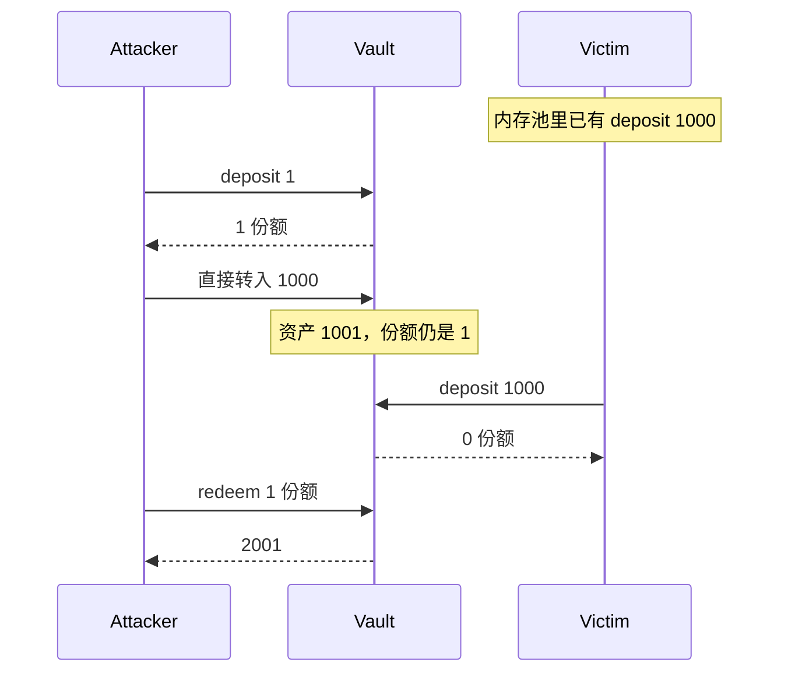
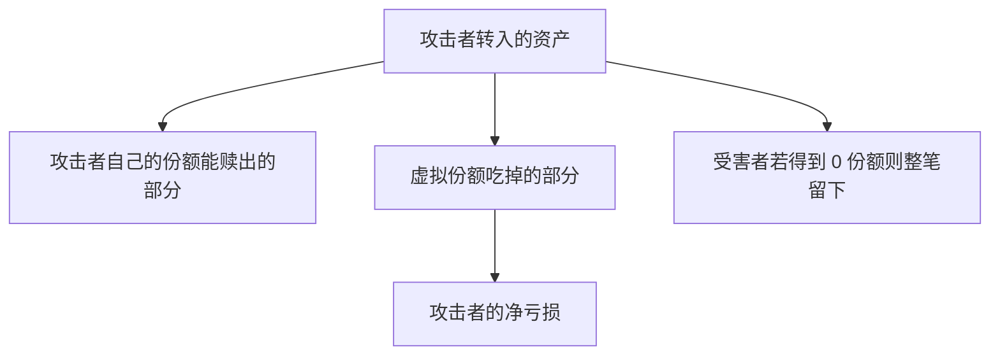
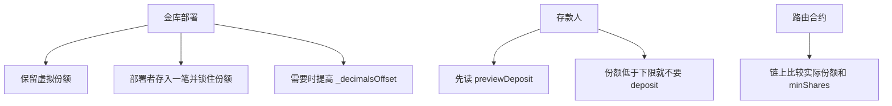

# Vault 通胀攻击

ERC-4626 金库用「当前资产 / 当前份额」给份额定价。份额按这个价格向下取整。有人把资产直接转进金库、不铸造份额时，单价升高，后来的存款人用同样的资产买到更少的份额。差出来的价值归当时的股东。

空金库或几乎空的金库上，攻击者可以先占住极少份额，再转入一大笔资产把单价抬高，让受害者的存款取整成 0。这叫通胀攻击，也叫捐赠攻击。主网上常见做法是抢跑：在受害者的 `deposit` 前面插入「存 1 wei + 转入资产」，在它后面赎回。

`SimpleVault` 的汇率来自 OpenZeppelin [ERC4626](https://github.com/OpenZeppelin/openzeppelin-contracts/blob/master/contracts/token/ERC20/extensions/ERC4626.sol)（v5.7.0），没有改 `_convertToShares` 或 `_decimalsOffset()`。`_decimalsOffset()` 为 0，所以存款和赎回是：
```solidity
    /**
     * @dev Internal conversion function (from assets to shares) with support for rounding direction.
     */
    function _convertToShares(uint256 assets, Math.Rounding rounding) internal view virtual returns (uint256) {
        return assets.mulDiv(totalSupply() + 10 ** _decimalsOffset(), totalAssets() + 1, rounding);
    }

    /**
     * @dev Internal conversion function (from shares to assets) with support for rounding direction.
     */
    function _convertToAssets(uint256 shares, Math.Rounding rounding) internal view virtual returns (uint256) {
        return shares.mulDiv(totalAssets() + 1, totalSupply() + 10 ** _decimalsOffset(), rounding);
    }
```

```text
shares = assets * (totalSupply + 1) / (totalAssets + 1)   // 向下取整
assets = shares * (totalAssets + 1) / (totalSupply + 1)   // 向下取整
```

分子、分母里的 `+1` 是 1 个虚拟份额和 1 个虚拟资产。`totalAssets()` 是金库的 vASSET 余额。[donate](https://github.com/lbc-2026s3/bootcamp_2026_s3_vibe_coding_foundry/blob/main/src/erc-4626/SimpleVault.sol#L22) 和任何人直接 `transfer` 进来的资产都会抬价。下面先用没有虚拟份额的旧公式把攻击算清楚，再看这份公式把它变成亏本，以及用户仍会亏钱的情况。

## 取整把零头送给老股东

向下取整最多抹掉不到 1 份额的资产。金库很大、存款人拿到很多份额时，这点零头可以忽略。拿到的份额越少，零头占本金的比例越大。

| 实际拿到的份额 | 取整最多吃掉的比例 |
| --- | --- |
| 0 | 100% |
| 1 | 可以接近一半，见下面的部分窃取 |
| 100 | 约 1% |
| 10,000 | 约 0.01% |

OpenZeppelin 的结论：想把取整损失压到大约 1% 以内，这次存款至少要拿到 100 份额。`previewDeposit` 返回 0，表示这笔存款会整笔留在金库里。

正常收益和攻击用的是同一条汇率。Alice 存 100，Carol `donate` 100，Bob 再存 100：

```text
Alice:  shares = 100 * 1 / 1 = 100
捐赠后: totalAssets = 200, totalSupply = 100
Bob:    shares = 100 * (100 + 1) / (200 + 1) = 50
```

现在金库里是 300(100+100+100) 资产、150(100+50) 份额，再加 1 个虚拟份额。Alice 的 100 份额约值 199，接近她的本金加上 Carol 的捐赠。Bob 的 50 份额约值 99，少掉的 1 是取整。Carol 自己没有份额，拿不回捐赠。这是金库设计里的收益，不是攻击。
- Alice: 100 * (300 + 1) / (150 + 1) = 199
- Bob:    50 * (300 + 1) / (150 + 1) = 99

攻击是在还没有足够份额垫底时，故意把单价推到「下一次存款取整后几乎什么都不剩」。


## 没有虚拟份额时

旧公式是：

```text
shares = assets * totalSupply / totalAssets   // 向下取整
```

空金库上第一次存款按 1:1 处理。之后的计算不再加虚拟的 1。

### 把受害者打成 0 份额

攻击者准备好受害者即将存入的金额。这里受害者存 1000。

| 步骤 | totalAssets | totalSupply | 说明 |
| --- | ---: | ---: | --- |
| 空金库 | 0 | 0 | |
| 攻击者存 1 | 1 | 1 | 得到 1 份额，成为唯一股东 |
| 攻击者转入 1000 | 1001 | 1 | 不铸造份额。单价约为 1001 资产 / 1 份额 |
| 受害者存 1000 | 2001 | 1 | `1000 * 1 / 1001 = 0` 份额，1000 资产已经转入 |

```text
受害者份额 = 1000 * 1 / 1001 = 0
```

攻击者赎回那 1 份额，拿走全部余额 2001。他投入了 1 + 1000 = 1001，利润是 1000，等于受害者的本金。捐赠会随赎回回到他手里，所以这笔「捐赠」只是临时占用资金。

把受害者打成 0 份额的条件是：

```text
u * a0 / (a0 + a1) < 1
```

`a0` 是攻击者自己的存款，`a1` 是他转入的资产，`u` 是受害者的存款。取 `a0 = 1`、`a1 = u` 就够。攻击者要动用的资金和能偷到的金额同一量级。



### 只偷一部分

假设 `shares == 0` 时 `deposit` 会 revert。攻击者少转一些，让受害者的份额停在 1，交易仍会成功。

攻击者已经存了 1，金库是 1 资产、1 份额。再转入 `a1` 之后，受害者存 `u = 1000` 时：

```text
受害者份额 = floor(1000 * 1 / (1 + a1))
```

分子里的 `1` 是当时的 `totalSupply`。攻击者只有 1 份额，所以它等于 `floor(1000 / (1 + a1))`。

份额恰好是 1，就是 `floor(1000 / (1 + a1)) = 1`，也就是商落在 `[1, 2)`：

```text
1 <= 1000 / (1 + a1) < 2
```

分母 `1 + a1` 是正数，两边乘它，不等号方向不变：

```text
左：1000 / (1 + a1) >= 1  ⇒  1000 >= 1 + a1  ⇒  1 + a1 <= 1000
右：1000 / (1 + a1) < 2   ⇒  1000 < 2 * (1 + a1)  ⇒  1 + a1 > 500
```

合起来是 `500 < 1 + a1 <= 1000`。`1 + a1` 是整数，大于 500 就是至少 501：

```text
501 <= 1 + a1 <= 1000
500 <= a1 <= 999
```

`a1 = 499` 时分母是 500，`floor(1000 / 500) = 2`。`a1 = 1000` 时分母是 1001，`floor(1000 / 1001) = 0`，回到上一节。所以 500 是「仍然只拿到 1 份额」里转入最少的一档，也是这一档里利润最大的一档。

取 `a1 = 500`：

| 步骤 | totalAssets | totalSupply | 计算 |
| --- | ---: | ---: | --- |
| 攻击者存 1 | 1 | 1 | 空金库 1:1，得到 1 份额 |
| 转入 500 | 501 | 1 | 不铸造份额 |
| 受害者存 1000 | 1501 | 2 | `floor(1000 / 501) = 1`，两人各 1 份额 |

赎回仍用旧公式 `assets = floor(shares * totalAssets / totalSupply)`。攻击者先赎回自己的 1 份额：

```text
得到 = floor(1 * 1501 / 2) = 750
成本 = 1 + 500 = 501
利润 = 750 - 501 = 249
```

池子剩下 `1501 - 750 = 751`，份额剩下 1。受害者再赎回，拿到 751。本金 1000，损失 `1000 - 751 = 249`。

1501 是奇数，`floor` 让先赎回的人拿 750，多出来的 1 留给后赎回的人。`750 + 751 = 1501`。若受害者先赎回，他拿 `floor(1501 / 2) = 750`，损失 250；攻击者再拿 751，利润 250。谁先走差 1 wei，利润的量级不变。

这 249 是攻击者那 1 份额在受害者存入后涨出来的：

```text
存入前，1 份额对应 501
存入后，1501 资产 / 2 份额，1 份额对应 750
750 - 501 = 249
```

受害者拿回的 751，大约是自己 1000 的一半，加上原池子 501 的一半。另一半 1000 留在攻击者赎回的那 750 里。

同一受害者、攻击者都先赎回时，`a1` 差 1 结果就不同：

| a1 | 受害者份额 | 攻击者赎回 | 成本 | 利润 | 受害者拿回 | 受害者损失 |
| ---: | ---: | ---: | ---: | ---: | ---: | ---: |
| 499 | `floor(1000 / 500) = 2` | `floor(1500 / 3) = 500` | 500 | 0 | 1000 | 0 |
| 500 | `floor(1000 / 501) = 1` | `floor(1501 / 2) = 750` | 501 | 249 | 751 | 249 |
| 999 | `floor(1000 / 1000) = 1` | `floor(2000 / 2) = 1000` | 1000 | 0 | 1000 | 0 |
| 1000 | `floor(1000 / 1001) = 0` | 2001 | 1001 | 1000 | 0 | 1000 |

`a1 = 499` 时受害者有 2 份额，池子 1500 资产、3 份额，攻击者只占 1/3，赎回 500，刚好覆盖成本。`a1 = 999` 时两人仍各 1 份额，池子 2000，各拿 1000，攻击者的成本也是 1000。只有把份额压到 0，他才赚到全部 1000。`shares > 0` 就回退，去掉的是最后一行；`a1 = 500` 这一行份额是 1，回退条件不成立，受害者仍损失 249。

## 这份金库里的虚拟份额

`_decimalsOffset() = 0` 时，空金库仍是 1:1：`assets * 1 / 1 = assets`。攻击者再想把后来的存款打成 0，转入的资产必须多到能盖过那个虚拟份额。虚拟份额会分走捐赠，攻击者赎不回全部本金。

仍以受害者存 1000 为例。攻击者先存 1，得到 1 份额。要把受害者打成 0：

```text
1000 * (1 + 1) / (1 + a1 + 1) < 1
2000 / (a1 + 2) < 1
a1 > 1998
```

他至少转入 1999。受害者存 1000 之后，金库是 3000 资产、1 真实份额。攻击者赎回：

```text
得到 = 1 * (3000 + 1) / (1 + 1) = 1500
成本 = 1 + 1999 = 2000
利润 = 1500 - 2000 = -500
```

受害者得到 0 份额，损失 1000。攻击者亏 500。亏损来自虚拟份额：有效份额是真实的 1 加上虚拟的 1，他只能拿回池子的一半左右，而池子里有很大一块是他自己转进去的。

OpenZeppelin 对偏移 `_decimalsOffset() = δ` 的结论是：要把一笔存款 `u` 打成 0 份额，攻击者在捐赠上的损失至少是 `10^δ * u`。

- `δ = 0`：损失至少等于受害者的存款，攻击不赚钱。
- `δ` 每加 1，攻击成本提高 10 倍。

`δ = 3` 时，虚拟份额是 1000。攻击者存 1，铸出 1000 份额。要把 1000 的存款打成 0，他得转入 1,999,999。赎回大约拿回 1,000,500，利润约 -999,500。受害者仍损失 1000。成本大约是赃款的 1000 倍。



虚拟份额挡的是「攻击者赚钱」。它会吃掉金库收益里很小的一部分，这是换这个性质的代价。金库若发生亏损、持有人陆续退出，先退出的人承担的亏损略小，最后退出的人略大。

不要覆盖 `_convertToShares` / `_convertToAssets` 把这两个 `+1` 去掉，除非另外做了下面的种子存款。去掉之后，本节第一段的旧公式重新生效，抢跑又会赚钱。

## 用户仍会亏钱的两种情况

虚拟份额存在时，下面两笔交易也不会回退。

### 还没有股东时先有了资产

有人 `donate` 1000，此时 `totalSupply = 0`。另一人存 500：

```text
shares = 500 * (0 + 1) / (1000 + 1) = 0
```

`deposit` 先把 500 转进金库，再铸造 0 份额。存款人没有 svASSET，之后 `redeem` 取不回这笔钱。当时没有真实股东，这 1500 挂在那 1 个虚拟份额上。

后来 Alice 存 1501，得到 1 份额，再赎回，拿回 1501。她的本金回来了，先前卡住的 1500 仍留在虚拟份额上，普通用户拿不走。被取整成 0 的那个人已经亏了。

### 拿到的份额很少

攻击者存 1 并转入 1998 之后，金库是 1999 资产、1 份额。有人存 1500：

```text
shares = 1500 * (1 + 1) / (1999 + 1) = 1
```

这 1 份额在当时的池子里约值 1166。存款人少了 334。攻击者若赎回自己的 1 份额，也大约只拿回 1166，成本是 1999，他仍在亏。亏损进了虚拟份额，但存款人的交易是成功的。

所以存款前要看拿到多少份额，不能只看交易是否成功。

## 怎么预防

三层一起用。虚拟份额让攻击亏本，种子存款把抬价的成本抬高，滑点检查让存款人在份额太少时整笔失败。



### 金库

保留 OpenZeppelin 默认的虚拟资产和虚拟份额。本仓库已经如此。

部署后、对用户开放前，由部署者存入一笔不可忽略的资产，把铸出的份额转到无人能动的地址。这些份额仍算在 `totalSupply` 里，抬价的人要先压过这笔存量。份额要转走，不要 `burn`。`burn` 会减少 `totalSupply`，同样的资产对应更少的份额，单价更高，金库更容易被抬价。

虚拟份额就是这个办法的最小版本：1 个虚拟资产配 1 个虚拟份额。种子存款越大，攻击者要转入的资产越多。

把 `_decimalsOffset()` 调大，份额使用比底层资产更多的小数位。`decimals()` 等于资产小数位加上这个偏移。偏移为 6 时，打成 0 份额的损失至少是存款的 10^6 倍。份额数量会变大，积分和前端要按新的 `decimals()` 显示。

可选的最后一道闸：`deposit` 里若 `assets > 0` 且算出的份额是 0，就回退。这能拦住「存 500、铸出 0」那种整笔损失，也和 ERC-4626 把滑点列为 `deposit` 可以回退的理由一致。它拦不住「铸出 1 份额、本金去掉一截」。`deposit(0)` 本来就会得到 0 份额，判断里要把「资产为 0」分开，避免和被取整吞掉混在一起。

另一类金库不把 `balanceOf` 当作 `totalAssets()`，只在 `deposit` 和专门的入账函数里增加内部记账。直接 `transfer` 进来的代币不影响汇率，通胀攻击的抬价步骤失效。那种金库的收益也必须走入账函数。本 demo 的收益就是 `donate` 带来的余额增加，所以用余额当 `totalAssets()`，再靠虚拟份额和滑点，而不是忽略直接转入。

### 存款人

调用 `deposit` 之前读 `previewDeposit(assets)`。返回 0，或者份额少到取整损失超过你能接受的比例，就不要发这笔交易。经验数字是至少拿到 100 份额，把取整损失压到大约 1% 以内。空金库、份额和资产都是 0 时，`previewDeposit(100)` 得到 100，可以存。

ERC-4626 的 `deposit(uint256 assets, address receiver)` 没有「最少份额」参数。链上要强制这个下限，用路由合约：里面先 `deposit`，再要求实际份额不少于调用者传入的 `minShares`，不够就回退。OpenZeppelin 在 `ERC4626` 的注释里指向了这类路由。只在本地算好预期份额、链上却不检查，抢跑仍能在你的交易被打包前把单价抬高。

`mint` 是先指定份额、再向上取整收取资产。份额不会被打成 0，但单价被抬高时，同样的份额会多扣资产。用 `previewMint` 看要付多少，设一个最多愿意付的资产上限。
