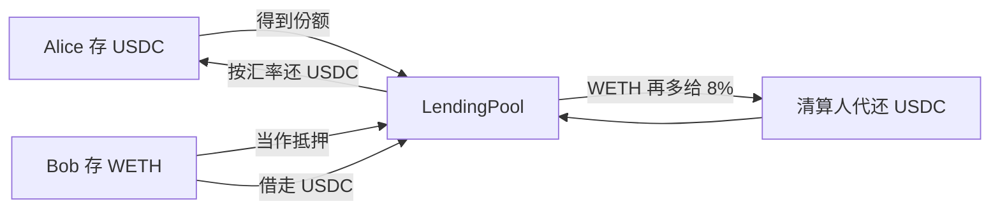

# 教学借贷池

这个池子做一件事：有 USDC 的人把钱放进来吃利息，有 WETH 的人把币押在这里、借走 USDC。借走的钱就是存款人的钱，所以借款人要付利息，存款人分享大部分利息。

下面用一笔具体的账把整条链路走完。数字和 `LendingPool` 的默认参数一致，方便对照测试。

## 先记住这四个人

| 谁 | 做什么 |
|---|---|
| Alice，存款人 | 存入 1000 USDC。她暂时用不到这笔钱，想让它生息 |
| Bob，借款人 | 有 1 枚 WETH，不想卖掉。押进池子，借出 USDC 去用 |
| 清算人 | Bob 的抵押品不值钱了，他替 Bob 还一部分债，并拿走 Bob 的一部分 WETH，而且比所还的债多拿一点 |
| 协议 owner | 利息里有一小份记在协议名下，owner 可以把它提走 |

两种代币都是 18 位小数的演示币。主网上的 USDC 是 6 位小数；这里改成 18 位，是为了让「数量 × 价格 / 1e18」直接得到美元。



合约分成四块，每块只做一件事：

| 合约 | 作用 |
|---|---|
| [`MockERC20.sol`](./MockERC20.sol) | 演示用的 WETH 和 USDC，谁都可以 `mint` |
| [`SimplePriceOracle.sol`](./SimplePriceOracle.sol) | 回答「1 个代币值多少美元」。部署者用 `setPrice` 改价 |
| [`JumpRateModel.sol`](./JumpRateModel.sol) | 只算利率。池子越空，借款越贵 |
| [`LendingPool.sol`](./LendingPool.sol) | 真正记账：存款、抵押、借款、还款、清算 |

## 学习路线

第一遍只读 [`LendingPool.sol`](./LendingPool.sol)。按下面的顺序往下看，每一站只回答一个问题。下面的故事可以对照着读。

1. **规则写死在构造参数里。** 先看 `collateralFactor`、`liquidationIncentive`、`closeFactor`、`reserveFactor`。抵押率、清算奖励、单笔清算上限、储备金比例，部署之后都不变。
2. **账本是那一组状态变量。** `totalShares` 和 `sharesOf` 是存款人的份额。`totalBorrows`、`borrowIndex`、`principalOf`、`userIndexOf` 是借款人的债。`collateralOf` 是锁着的 WETH。`totalReserves` 是协议抽走的那一截利息。
3. **先看怎么读数，再看怎么改账。** `cash` 是池子里还剩多少 USDC。`exchangeRate` 是一份份额能换回多少 USDC。`borrowBalanceStored` 是某个用户已经记下的债务。`getAccountLiquidity` 是还能借多少，或者已经短了多少。
4. **利息靠下一次调用来补。** 看 `accrueInterest`，再跳到文件底部的 `_accrueInterest`。后面每个会改账的函数都会先走这里。
5. **存款人的进出。** `deposit` 按汇率发份额，`withdraw` 烧掉份额、取回 USDC。
6. **抵押品的进出。** `depositCollateral` 把 WETH 记到 `collateralOf`。`withdrawCollateral` 取走之前会检查取完是否还健康。
7. **借款和还款。** `borrow` 把新债务写进 `principalOf`，并把当时的 `borrowIndex` 抄到 `userIndexOf`。`repay` 先把债务滚到现在，再交给 `_reduceDebt` 扣掉偿还额、更新指数。
8. **清算。** `liquidate` 先确认有短亏，再按 `closeFactor` 限制代还金额，按 `liquidationIncentive` 计算拿走多少 WETH。
9. **协议抽成怎么离开池子。** `reduceReserves` 把 `totalReserves` 转给 owner。现金和储备金一起减少，存款汇率不变。
10. **健康检查在文件末尾。** `_usdValues` 把抵押品和债务都换成美元，`_requireHealthy` 要求债务不超过抵押品价值乘抵押率。`borrow` 和 `withdrawCollateral` 都会用到它。

## 第一笔：Alice 把 1000 USDC 存进来

池子里原来没有钱。Alice 调用 `deposit(1000)`。

池子做两件事：收下 1000 USDC，给 Alice 记 1000 份份额。此时 1 份份额 = 1 USDC，所以汇率是 1。

份额不是另一种可以拿去别处交易的代币，只是池子内部的一本账：`sharesOf[Alice] = 1000`，`totalShares = 1000`。以后池子赚了利息，份额数量不变，每一份能换回的 USDC 变多。Alice 要退出时调用 `withdraw`，烧掉份额，拿回对应的 USDC。

还没有利息时，后来的人也是 1 USDC 换 1 份。Dave 再存 500 USDC，得到 500 份。Alice 的 1000 份不变，总份额变成 1500。之后的利息按份数分：Alice 占三分之二，Dave 占三分之一。

等池子赚到利息，1 份份额能换回的 USDC 会超过 1。那时候再存 1000 USDC，就换不到 1000 份了。后面 Carol 的例子就是这种情况。

## 第二笔：Bob 抵押 1 WETH，借走 800 USDC

Bob 不能凭空借。他先 `depositCollateral(1 WETH)`。这 1 WETH 锁在池子里，Bob 还清债之前不能随便全部取回。

预言机说 1 WETH = 2000 美元，1 USDC = 1 美元。抵押率是 75%，意思是：

```text
最多能借的美元 = 抵押品美元价值 × 75%
              = 2000 × 0.75
              = 1500 USDC
```

Bob 借 800，没有超过 1500，交易成功。池子把 800 USDC 转给他。

这时池子里还剩 200 USDC 现金。那 800 并没有消失，它变成了 Bob 欠池子的债。Alice 的 1000 USDC 现在分成两截：200 还躺在合约里，800 在 Bob 手里、由 Bob 的债务表示。

Bob 再多借、一旦超过 1500，交易会失败。他想把抵押品取走、取完之后债务仍然超过上限，交易也会失败。

## 利用率：池子有多「被借空」

借款利率不看 Bob 是谁，只看整池被借走了多少。

```text
利用率 = 总债务 / (池内现金 + 总债务 - 储备金)
```

刚借完、还没有利息时：

```text
利用率 = 800 / (200 + 800 - 0) = 80%
```

80% 的意思是：存款人的钱有八成在借款人手里，池子里只剩两成现金。谁想取款，只能取这剩下的现金。Alice 现在调用 `withdraw(1000)` 会失败，因为合约里只有 200 USDC。Bob 还钱之后，现金回来，Alice 才能把本金和利息一起取走。

## 利率为什么会突然变陡

模型叫 Jump Rate，和 Compound 同一条思路：钱还充裕时利率温和，钱快被借光时利率陡增，促使借款人还款、吸引新的存款。

部署时写的是年化，合约里存成「每秒利率」（年化除以 `365 days`）。`1e18` 表示 100%。

```text
利用率 ≤ 80%：  年化 = 2% + 利用率 × 10%
利用率 > 80%：  年化 = 2% + 80% × 10% + (利用率 - 80%) × 450%
```

| 利用率 | 借款年化 | 怎么来的 |
|---|---|---|
| 0% | 2% | 这是借款人的底息。总债务为 0 时，实际利息仍是 0 |
| 50% | 7% | 2% + 50% × 10% |
| 80% | 10% | 2% + 80% × 10%。这是拐点 |
| 90% | 55% | 2% + 80% × 10% + (90% - 80%) × 450% |
| 100% | 100% | 2% + 80% × 10% + (100% - 80%) × 450% |

Bob 这笔账的利用率正好 80%，所以他的借款年化是 10%。如果池子被借到 90%，后来的借款人就要付大约 55%。拐点（`kink`）就是 80% 这条线。

没人借款时，Alice 没有利息。新增利息是 `总债务 × 借款利率 × 时间`。总债务是 0，这个乘积就是 0，汇率一直是 1，她取回的还是原来的 1000 USDC。表里 0% 利用率对应的 2%，是「已经有人借了、但借得很少」时借款人要付的底息，不是存款人的保底收益。存款人拿到的大约是 `借款利率 × 利用率 × 90%`，利用率是 0，存款利率也是 0。

## 利息记在指数上，而不是每秒改一次余额

区块链没有闹钟。没人调用合约，状态就不会变。所以池子用「懒更新」：谁下一次调用存款、取款、借款、还款、清算或 `accrueInterest`，合约就把「从上次计息到现在」的利息一次补上。

补利息靠一个全局的 `borrowIndex`，一开始是 1.0。

Bob 借出 800 的那一刻，池子记下两样东西：

```text
principal  = 800          当时的债务
userIndex  = 1.0          当时的全局指数
```

时间过去之后，全局指数变大。Bob 现在的债务是：

```text
当前债务 = principal × 现在的 borrowIndex / userIndex
```

假设中间没有别人借还，利用率一直按借款时的 80% 计，过了一整年才有人来碰合约。年化 10%，指数大约从 1.0 变成 1.1：

```text
Bob 的债务 = 800 × 1.1 / 1.0 = 880 USDC
```

多出来的 80 USDC 就是这一年的利息。Bob 中途还款也一样：先按上面的公式把债务滚到「现在」，再扣掉还掉的金额，然后把他的 `userIndex` 更新成此刻的全局指数。这样他不会把别人已经产生的利息再付一遍。

`borrowBalanceStored` 读的是已经记进指数的债务。刚把时间快进完、还没调用任何函数时，这个数还是旧的。要看最新债务，先调用 `accrueInterest()`。

## 存款人怎么分到利息

这 80 USDC 利息不会全部给 Alice。10% 记成协议储备金，90% 留给存款人。

```text
利息       = 80 USDC
储备金     = 80 × 10% = 8 USDC
留给存款人 = 72 USDC
```

Alice 的份额还是 1000，没有增发。她能换回的 USDC 变多了，因为汇率的分子变大了：

```text
汇率 = (池内现金 + 总债务 - 储备金) / 总份额
    = (200 + 880 - 8) / 1000
    = 1.072
```

Alice 的 1000 份份额现在值 1072 USDC：本金 1000，加上她分到的 72。储备金那 8 USDC 不算在她的份额里。

这时如果 Carol 也来存 1000 USDC，她拿不到 1000 份。按汇率 1.072，她大约得到 `1000 / 1.072 ≈ 933` 份。她和 Alice 一样，每一份都值 1.072 USDC，只是来晚了，同样的钱买到的份数更少。后来的人按当前价格入场，不会把前面的人已经赚到的利息分薄。

owner 调用 `reduceReserves` 把那 8 USDC 提走时，池子里的现金少 8，账上的储备金也少 8，汇率的分子不变，Alice 的份额价格不变。

存款人看到的利率会低于借款人。借得越满，存款利率越高，因为更多的钱在外面生息；同时池子里能立刻取走的现金更少。

## 什么叫健康，什么叫该被清算

每个借款人随时可以算两个美元数：

```text
抵押品价值 = WETH 数量 × WETH 价格
债务价值   = 当前债务 × USDC 价格
借款上限   = 抵押品价值 × 75%
```

债务不超过上限，仓位就是健康的。`getAccountLiquidity` 会返回还剩多少额度，或者已经短了多少。这个视图函数自己不计息，读数前要先 `accrueInterest()`。

Bob 刚借完时：抵押品 2000 美元，上限 1500，债务 800，还健康。价格跌到 1000 美元时，上限变成 750。若债务仍是 800，他就短了 50 美元，可以被清算。

清算是别人替他还债，并把他的抵押品转给还债的人。规则有两条，都是为了让清算发生、同时给借款人留下补救的余地：

1. 一笔最多还当前债务的 50%（close factor）。债要分几次清，借款人有机会自己补抵押或还款。
2. 清算人拿到的抵押品，按他所还债务的美元价值再多 8%。奖励用来让价格刚跌破上限时，仍有人愿意掏 USDC 来还债。

沿用前面的数字，但先忽略这一年的利息，让债务仍是 800，方便口算。池内现金 200，总债务 800，Bob 抵押 1 WETH。价格从 2000 跌到 500：

```text
抵押品价值 = 500 美元
借款上限   = 500 × 75% = 375 美元
债务       = 800 美元     已经超过上限，可以清算

清算人最多代还 800 × 50% = 400 USDC
他应拿到的抵押品 = 400 × 1.08 / 500 = 0.864 WETH
```

交易之后：Bob 还欠 400 USDC，还剩 0.136 WETH；清算人付出 400 USDC，得到 0.864 WETH（按 500 美元计价是 432 美元）。多出来的 32 美元就是那 8% 奖励。

如果价格跌到 100 美元，按 50% 债务计算要拿走 4.32 WETH，Bob 只有 1 WETH，这一笔会失败。清算人改还一个更小的数，只要算出来的 WETH 不超过余额，就可以成功。还不起的部分继续留在 Bob 的债务上。

健康的仓位不能被清算。价格还是 2000 时，有人调用 `liquidate` 会直接失败。

## 读代码时容易卡住的地方

**利息不会自己涨。** 测试里要先 `vm.warp`，再调用 `accrueInterest()` 或任意一笔存取借还，债务和汇率才会变。

**现金是真实的代币余额。** `cash()` 就是合约里的 USDC 余额。有人绕过 `deposit`、直接把 USDC 转进合约，份额数量不变，汇率会上升，等于把钱送给现有存款人。

**空池的第一笔存款按 1:1 给份额。** 演示时先正常存入流动性，再借款。

**预言机的价格是部署者写上去的。** 测试里把 WETH 从 2000 改成 500，就是在模拟行情下跌。

**抵押的 WETH 没有利息。** 只有借出去的 USDC 计息。WETH 在这里只是押品。

## 部署

本地 anvil 上部署四种合约，并写入初始价格和上面的利率：

```bash
forge script script/lending/DeployLendingPool.s.sol:DeployLendingPool \
  --broadcast --rpc-url local \
  --private-key 0xac0974bec39a17e36ba4a6b4d238ff944bacb478cbed5efcae784d7bf4f2ff80 \
  && cat ./deployments/LATEST.txt
```

重跑这条链路的测试：

```bash
forge test --match-path 'test/lending/*.t.sol' -vv
```
