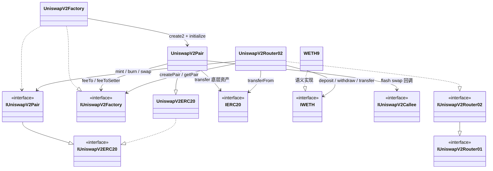
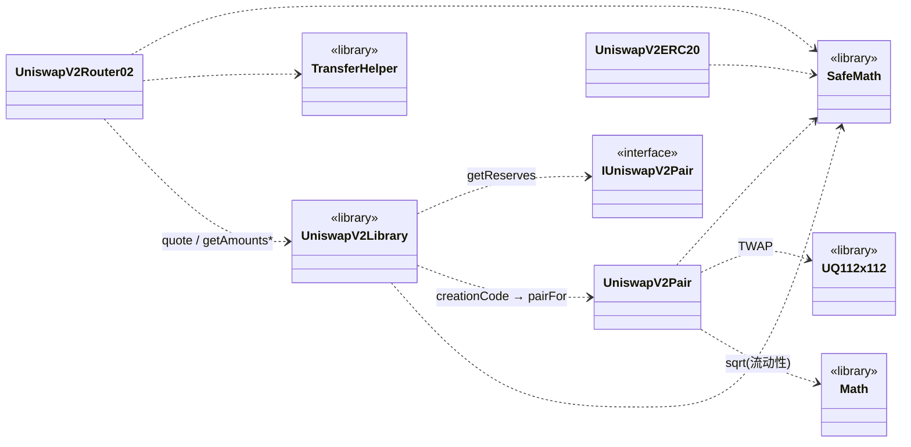
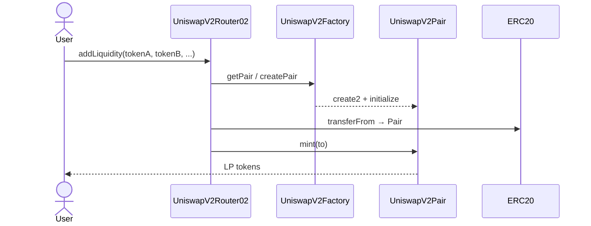

# Uniswap V2（本仓库 fork）学习顺序

按 **依赖从下到上、概念从简单到完整** 阅读。本目录（`src/uniswapv2/`）是适配到 Solidity `^0.8.24` 的 Uniswap V2 核心 + Router；`pairFor` 使用 live `creationCode`，**init code hash 与以太坊主网不同**，外部工具勿混用主网硬编码 hash。remapping：`uniswapv2/=src/uniswapv2/`。

## 合约依赖关系（UML）

图例：`◀|--` 继承 / 实现 · `-->` 运行时调用或持有引用 · `..>` 编译期引用（library / creationCode）

### 核心类图



说明（与本 fork 源码一致）：

- `UniswapV2Pair` **继承** `UniswapV2ERC20`，接口层 `IUniswapV2Pair` **继承** `IUniswapV2ERC20`；Pair 合约本身**未**写 `is IUniswapV2Pair`（ABI 仍对齐，但无编译期接口检查）。
- Factory 用 `type(UniswapV2Pair).creationCode` + `create2` 部署 Pair，再 `IUniswapV2Pair(pair).initialize`。
- 用户通常只碰 Router；Router 经 Factory / Pair 接口操作池子，ETH 路径经 WETH。

### Library 依赖



### 运行时调用链（加池）



可跳过、未画入主图：`IUniswapV2Migrator`、`interfaces/V1/*`。

## 第 0 层：接口扫一眼（只看签名）

先建立「谁调用谁」的地图，不必深读实现：

1. `interfaces/IERC20.sol`
2. `interfaces/IUniswapV2ERC20.sol` — LP token
3. `interfaces/IUniswapV2Pair.sol` — 池子核心 API
4. `interfaces/IUniswapV2Factory.sol` — 建池 / 查池
5. `interfaces/IUniswapV2Router01.sol` → `IUniswapV2Router02.sol` — 用户入口
6. `interfaces/IWETH.sol`、`interfaces/IUniswapV2Callee.sol` — WETH / flash swap 回调

可跳过：`IUniswapV2Migrator.sol`、`interfaces/V1/*`（V1 迁移遗留，本仓库基本不用）。

## 第 1 层：工具库（Pair / Router 的积木）

7. `libraries/SafeMath.sol` — 0.8 下仍保留的 checked 风格
8. `libraries/Math.sol` — `sqrt`（mint 首池流动性）
9. `libraries/UQ112x112.sol` — TWAP 定点小数（读 `encode` / `uqdiv` 即可）
10. `libraries/TransferHelper.sol` — 安全 `transfer` / `transferFrom` / ETH

## 第 2 层：核心三件套（最重要）

11. **`UniswapV2ERC20.sol`** — LP 是什么、`permit`
12. **`UniswapV2Pair.sol`**（整份精读）  
    建议顺序：`getReserves` → `mint` → `burn` → `swap` → `_update` / TWAP → `skim` / `sync` → flash（`IUniswapV2Callee`）
13. **`UniswapV2Factory.sol`** — `create2` 建池、`token0 < token1`、`feeTo`

心智模型：

```text
Factory.createPair → Pair（持有两种 token + 发 LP）
用户几乎不直接调 Pair，而是走 Router
```

## 第 3 层：定价与地址（Router 的大脑）

14. **`libraries/UniswapV2Library.sol`**（精读）  
    `sortTokens` → `pairFor`（CREATE2）→ `getReserves` → `quote` → `getAmountOut` / `getAmountIn` → `getAmountsOut` / `getAmountsIn`

本 fork 重点：`pairFor` 用 `type(UniswapV2Pair).creationCode`，不是主网硬编码 hash。

## 第 4 层：用户入口

15. **`WETH9.sol`** — `deposit` / `withdraw`（ETH ↔ WETH）
16. **`UniswapV2Router02.sol`**（按功能块读）
    - `addLiquidity` / `addLiquidityETH`
    - `removeLiquidity*`
    - `swapExact*` / `swap*ForExact*`
    - `*SupportingFeeOnTransferTokens*`（Router02 增量）
    - `ensure(deadline)` + `amountMin` 滑点

## 第 5 层：部署与验证（仓库配套）

在仓库根目录、与本目录配套：

17. `script/uniswapv2/ComputePairInitCodeHash.s.sol` — 看清 CREATE2 hash
18. `script/uniswapv2/DeployUniswapV2.s.sol` — Factory + WETH + Router 串起来
19. `test/uniswapv2/UniswapV2Router02.t.sol` — 用测试把加池 / swap / 撤池跑通

```bash
forge test --match-path 'test/uniswapv2/*'
```

## 推荐节奏（最短路径）

| 阶段 | 文件 | 目标 |
|------|------|------|
| Day 1 | ERC20 → Pair.mint/burn/swap → Factory | 懂「池子怎么存钱、怎么换」 |
| Day 2 | UniswapV2Library → Router 加池/swap | 懂 x\*y=k、滑点、path |
| Day 3 | WETH 路径 + FoT + 测试/脚本 | 懂 ETH 包装与真实调用链 |

**一条调用链串起来记：**

```text
Router.addLiquidity
  → Factory.createPair / Library.pairFor
  → transfer token 进 Pair
  → Pair.mint → 给你 LP
```

先把 **Pair + Library + Router 主路径** 吃透；UQ112x112 / flash swap / FoT 可以第二遍再抠。
