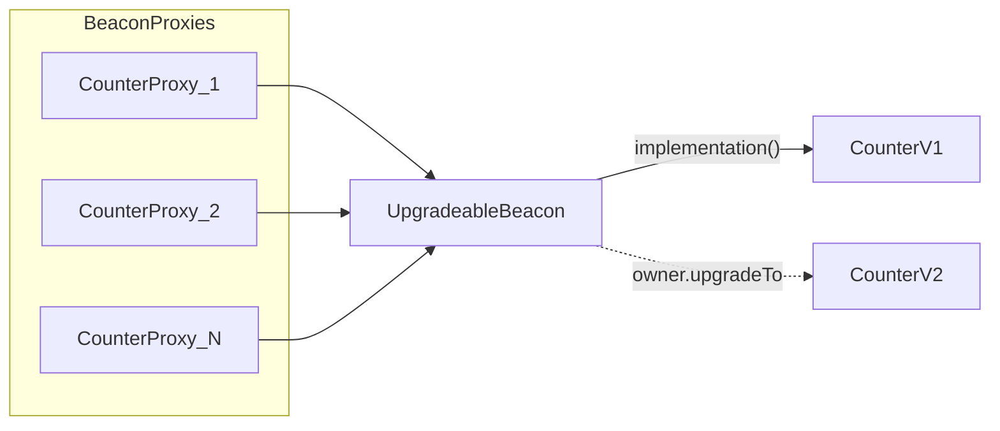

# Beacon Proxy Counter

用 OpenZeppelin **Beacon Proxy** 部署多份可升级 Counter：一份逻辑、一个 beacon、多个代理。一次 `upgradeTo` 即可升级全部实例。

对照：

| 模式 | 位置 | 升级 | 升级 N 个实例 |
|------|------|------|----------------|
| EIP-1167 Clones | [`src/mini_proxy/`](../../mini_proxy/) | 不可升级（impl 写死在 bytecode） | N/A |
| UUPS | [`src/upgradeable/MyERC721UpgradeableNFT.sol`](../MyERC721UpgradeableNFT.sol) | 每个 proxy 各自升级 | O(N) 笔交易 |
| **Beacon** | 本目录 | beacon 上一次升级 | **O(1)** 笔交易 |

## 为什么不用 UUPS？

Beacon 与 UUPS 解决不同问题：

- **UUPS**：升级逻辑在 *implementation*（`_authorizeUpgrade`），适合「一个地址、长期演进」的单个合约。
- **Beacon**：升级逻辑在 *UpgradeableBeacon*（`Ownable` + `upgradeTo`）。每个 `BeaconProxy` 调用时向 beacon 读取当前 implementation，**实现合约不需要** `UUPSUpgradeable`。

在 Beacon Counter 上再加 UUPS 只会多一套冲突的升级路径。本示例刻意不加 UUPS。

## 代价与收益

- **更贵**：单实例部署比 EIP-1167 clone 贵；每次调用多一次 beacon 的 `implementation()` 读取。
- **更便宜的是升级**：N 个实例只需 1 笔 `upgradeTo`，而不是 N 次 UUPS 升级。

## 架构



```text
CounterBeaconFactory (Ownable)
  └── beacon             // UpgradeableBeacon，owner = factory
        └── implementation() → Counter / CounterV2 / ...

BeaconProxy_1 ──┐
BeaconProxy_2 ──┼──► 同一 beacon（beacon 地址在 proxy 构造时固定）
BeaconProxy_N ──┘
```

- **factory owner**：谁可以调用 `factory.upgradeTo`（教学可用 EOA；生产应交给 multisig/timelock）。
- **beacon owner**：固定为 factory，以便 factory 转发升级。
- **当前逻辑地址**：读 `beacon.implementation()`。

## 文件

| 文件 | 作用 |
|------|------|
| [`Counter.sol`](./Counter.sol) | V1 逻辑：`Initializable` + `initialize` / `setNumber` / `increment` |
| [`CounterV2.sol`](./CounterV2.sol) | 继承 V1，追加 `decrement()`（无新存储字段） |
| [`CounterBeaconFactory.sol`](./CounterBeaconFactory.sol) | 部署 V1 + beacon，创建 `BeaconProxy`，转发升级 |

相关测试 / 脚本：

- [`test/upgradeable/beacon_proxy/CounterBeacon.t.sol`](../../../test/upgradeable/beacon_proxy/CounterBeacon.t.sol)
- [`script/upgradeable/beacon_proxy/`](../../../script/upgradeable/beacon_proxy/)（含 [`Deploy.md`](../../../script/upgradeable/beacon_proxy/Deploy.md)）

## 关键规则

1. 用 OZ 的 `BeaconProxy` + `UpgradeableBeacon`，不要手写 beacon 槽。
2. 初始化走 proxy 构造参数 `data`（`abi.encodeCall(Counter.initialize, ...)`），与「先部署再 initialize」等价且更原子。
3. 实现合约构造函数 `_disableInitializers()`，禁止直接初始化 implementation。
4. V2 存储布局只能追加，不能重排 / 删除（与 UUPS 相同）。本 V2 只加函数，无需 `reinitializer`。

## 本地验证

```shell
forge test --match-path 'test/upgradeable/beacon_proxy/*' -vv
```

覆盖点：多 proxy 独立 storage、一次升级全员生效、升级后再创建仍走新逻辑、非 owner / 直调 beacon 升级失败、重复 initialize 与实现合约 initialize 失败。

## 部署

见 [`script/upgradeable/beacon_proxy/Deploy.md`](../../../script/upgradeable/beacon_proxy/Deploy.md)。

1. `CounterBeaconFactory.s.sol`：部署 factory + 两份 V1 proxy  
2. `CounterV2.s.sol`：将 beacon 升级到 `CounterV2`
