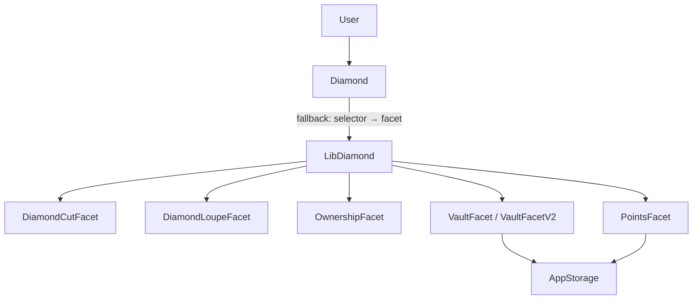

# PointsVault Diamond

用 **EIP-2535 钻石代理** 做一份可按函数粒度升级的 ETH 金库：同一地址先存款，再挂积分，再给取款加手续费。

对照：

| 模式 | 位置 | 升级单位 | 对外地址 |
|------|------|----------|----------|
| UUPS | [`src/upgradeable/MyERC721UpgradeableNFT.sol`](../MyERC721UpgradeableNFT.sol) | 整份 implementation | 1 个 proxy |
| Beacon | [`src/upgradeable/beacon_proxy/`](../beacon_proxy/) | 整份 implementation | N 个 proxy 共享 1 个 beacon |
| **Diamond** | 本目录 | **单个 selector**（Add / Replace / Remove） | **1 个钻石地址** |

## 为什么不用 UUPS / Beacon？

- **UUPS / Beacon**：一次换掉整份逻辑合约。适合「一个模块长期演进」。
- **Diamond**：`fallback` 按 `msg.sig` 查表再 `delegatecall` 到不同 facet。适合「一个协议拆成多个模块、分别升级」，也能绕过单合约 24KB 限制。

OpenZeppelin 没有官方 Diamond；本示例按 [EIP-2535](https://eips.ethereum.org/EIPS/eip-2535) 精简实现，不引入 Hardhat 依赖。

## 这个 demo 在演示什么？

假想你上线了一个很简单的 **ETH 金库**：用户往合约里存 ETH、查余额、再取出来。  
对外只有一个地址 `PointsVaultDiamond`——用户钱包、前端、浏览器里看到的合约地址永远不变。

钻石代理要证明的是：这个地址背后的能力可以**按功能一块一块地加 / 换 / 删**，而不必像 UUPS 那样整份逻辑一起换。

### 关键函数（都打在钻石地址上）

| 函数 | 谁调用 | 做什么 |
|------|--------|--------|
| `deposit()` | 用户 | 向金库存入 ETH（`msg.value`），增加该用户记账余额。V1 只记账；挂上积分后，新存款还会按 1 wei = 1 积分发分。 |
| `withdraw(amount)` | 用户 | 从金库取出 `amount` ETH 到调用者。V1 全额取出；换成 V2 后按 `withdrawFeeBps` 扣手续费，实到手 = amount − fee。 |
| `pointsOf(user)` | 任意人（只读） | 查询 `user` 当前积分。Add 之前钻石上没有这个函数；Add 之后才能调。 |
| `withdrawFeeBps()` | 任意人（只读） | 查询取款手续费率（basis points，100 = 1%）。Replace 到 V2 时一并 Add。 |
| `protocolFees()` | 任意人（只读） | 查询合约里累计扣留的手续费总额（ETH 仍留在钻石地址上）。 |
| `diamondCut(...)` | 仅 owner | 升级入口：给钻石 **Add / Replace / Remove** 函数（selector → facet）。用户存取款不调它；产品迭代才调它。 |

（另有 `balanceOf` / `totalDeposits` 查余额与总存款，以及 Loupe / Ownership 等基础设施函数，见架构一节。）

### 产品迭代四步

1. **先上线最小金库（V1）**  
   只有存、取、查余额。用户 Alice 存入 2 ETH，合约记下她的余额。

2. **产品要加「积分」：给钻石挂上新函数，并改写存款逻辑**  
   - **Add** `pointsOf`：以前没有，挂上后才能查积分  
   - **Replace** `deposit`：换成「存款时顺便发积分」的实现  
   - Alice 之前那 2 ETH **还在**（状态存在钻石自己的存储里，不跟 facet 走）；之后再存 1 ETH，才会开始有积分。

3. **产品要收 1% 取款手续费：只换取款，不动存款 / 积分**  
   - **Replace** `withdraw`：换成带手续费的版本  
   - **Add** `withdrawFeeBps` / `protocolFees`：方便查询费率与累计手续费  
   - 费率通过 `diamondCut` 时的一次性 init 写入；Alice 的余额和积分都还在。

4. **实验功能可以卸掉（Remove）**  
   测试里临时挂上一个 `ping()`，再 Remove 掉。卸掉之后再调就会失败——说明钻石不仅可以加能力，也可以裁剪能力。

一句话：**用户始终打同一个合约地址；owner 用 `diamondCut` 决定这个地址此刻能调哪些函数、每个函数跑哪段逻辑。**

## 两个 facet 出现相同函数签名（或相同 selector）怎么办？

钻石的路由表是 **`selector → facet`，一对一**。`fallback` 只查一次表，再 `delegatecall` 到唯一 facet——**不会**让两个实现同时响应同一个函数。

函数签名相同 ⇒ selector 一定相同（例如 `deposit()`）。本 demo 里 `VaultFacet` 与 `PointsFacet` 都有 `deposit()`，就是这种情况。

| `diamondCut` 操作 | 行为（见 [`LibDiamond.sol`](./libraries/LibDiamond.sol)） |
|-------------------|----------------------------------------------------------|
| **Add** | selector 已存在 → revert（`CannotAddFunctionToDiamondThatAlreadyExists`） |
| **Replace** | selector 必须已存在，且新 facet ≠ 旧 facet → 改指向新 facet |
| **Remove** | 删除该 selector 的映射 |

本 demo 的正确用法：先 Add `VaultFacet.deposit`；要改成「存款发积分」时，对同一 selector **Replace** 到 `PointsFacet`。旧 facet 代码仍在链上，但路由表不再指向它。

极少见的情况：不同函数名也可能哈希出相同 4 字节 selector。钻石只认 selector，不认函数名——同样只能挂一个。

### 生产级一般怎么处理？

规则与 demo 相同：**同 selector 不能并存**。生产更强调提前消冲突、显式升级：

1. **按领域拆 facet**，避免两个模块同时对外暴露同一签名；需要改行为的函数做成「可 Replace 的版本」。
2. **只 cut 白名单 selector**，不要把 facet 继承带来的多余 `public`/`external` 一并挂上。
3. **Cut 前做 selector 清单 / diff**（对照 Loupe），冲突则失败，绝不静默覆盖。
4. 换实现 = 治理下的正式 **Replace**（multisig + timelock）+ 可选 `_init` + Loupe 断言新路由。
5. 长期可考虑限制或弃权 `diamondCut`（冻钻石），并审计存储布局与 cut 权限。

一句话：**冲突不会智能合并；要么设计阶段消掉，要么用 Replace 明确指定谁生效。**

## 架构



```text
Diamond（唯一对外地址）
├── DiamondCutFacet       // diamondCut
├── DiamondLoupeFacet     // facets / facetAddress / supportsInterface
├── OwnershipFacet        // owner / transferOwnership
├── VaultFacet            // deposit / withdraw / balanceOf / totalDeposits
├── PointsFacet           // （Cut 后）pointsOf + 新的 deposit
└── VaultFacetV2          // （Cut 后）withdraw + 费率只读

AppStorage（独立 slot，所有 facet 共享）
├── balances / points / totalDeposits
└── withdrawFeeBps / protocolFees / v2Initialized   // V2 只能追加
```

## 文件

| 文件 | 作用 |
|------|------|
| [`Diamond.sol`](./Diamond.sol) | 构造时挂 V1 facets；`fallback` 路由 |
| [`libraries/LibDiamond.sol`](./libraries/LibDiamond.sol) | selector 表 + `diamondCut` |
| [`libraries/LibAppStorage.sol`](./libraries/LibAppStorage.sol) | 业务存储 |
| [`facets/`](./facets/) | Cut / Loupe / Ownership / Vault / Points / Experimental |
| [`inits/VaultV2Init.sol`](./inits/VaultV2Init.sol) | 不挂到钻石上，仅 `delegatecall` 写费率 |

相关测试 / 脚本：

- [`test/upgradeable/diamonds_proxy/PointsVaultDiamond.t.sol`](../../../test/upgradeable/diamonds_proxy/PointsVaultDiamond.t.sol)
- [`script/upgradeable/diamonds_proxy/`](../../../script/upgradeable/diamonds_proxy/)（含 [`Deploy.md`](../../../script/upgradeable/diamonds_proxy/Deploy.md)）

## 关键规则

1. 用户只调钻石地址；直接调 facet 不会写钻石存储。
2. facet **禁止**用构造函数写业务状态；状态走 `LibAppStorage`。
3. `diamondCut` 仅 owner。生产环境应把 owner 交给 multisig/timelock（owner 可 Remove 关键函数）。
4. AppStorage 只能追加字段。V2 费率通过独立 init 合约写入，不把 `init` 留在钻石 selector 表上。
5. 存取款走 Checks-Effects-Interactions + OZ `ReentrancyGuard`（ERC-7201 槽，各 facet 共享同一把锁）。
6. 禁止 `receive()` 裸入 ETH，必须走 `deposit()`。
7. V2 扣费后不变量：`address(diamond).balance == totalDeposits() + protocolFees()`（手续费仍留在钻石上；本 demo 不提供 claim，后续可再 Add sweep facet）。

## 本地验证

```shell
forge test --match-path 'test/upgradeable/diamonds_proxy/*' -vv
```

覆盖点：状态写在钻石上、Loupe 路由、Add 积分后旧余额仍在、Replace 取款扣费且积分不丢、Remove 末尾 / 中间 selector、非 owner / 冲突 selector 失败、费率 init 与 fuzz 取款。

## 部署

见 [`script/upgradeable/diamonds_proxy/Deploy.md`](../../../script/upgradeable/diamonds_proxy/Deploy.md)。
